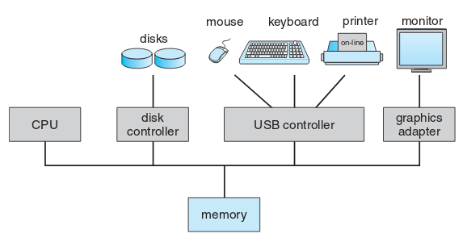
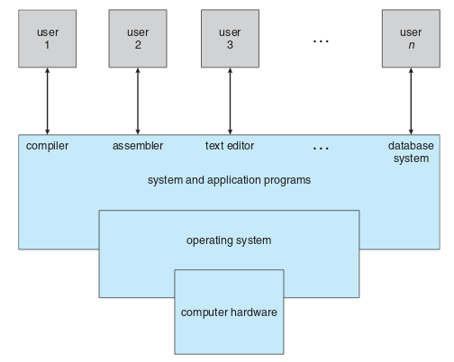

# Overview

## Why learn programming?
### Do things better

* Automation
    * Downloading, merging, and cleaning data
* Speed
* Collaboration using git
* Clarity and reproducibility


### Do new things
* Data sources
    * web APIs, web scraping, databases, geographic data, etc.)
* Visualizations
* Models
    * ``machine learning''

### Why now?
* Software is easier and more powerful
* More data is publicly available
    * e.g. municipal data portals
* More organizations are using these tools

## Syllabus

### Administrative
* Course website: [https://harris-ippp.github.io](https://harris-ippp.github.io)
    * Slides, readings, homework assignments
* TAs will host lab sessions in Harris room 224:
    * Mondays 10:30am (Minjia)
    * Mondays 4:30pm (Nicholas)
    * Tuesdays 4:30pm (Edric)
    * Wednesdays 9am (Darshan)
    * Wednesdays 1:30pm (Ratul)
    * Wednesdays 3pm (Umer)
* Canvas for discussion and grades


### Curriculum
* Week 1: low level tools (command line) and collaboration (git)
* Weeks 2-4: thinking algorithmically with python
* Weeks 5-10: higher level data analysis, databases, the web

### Assignments
* Posted Thursdays
* Work on and get help in lab the following M-W
* Due (on GitHub) following Thursday by 10:30am
* Reviewed in lab the following week

### Plagiarism policy
* Classmates
    * Discussion encouraged
    * Do not share answers
    * Each student must write their own code
* Internet
    * Websites (e.g. Stack Overflow) are very helpful
    * Make sure you understand what you are copying and pasting
    * Cite anything that you use that is 2 lines or more

### Quizzes
* Weekly quizzes in lecture on Tuesday
* On Canvas (so bring a laptop)
* About 5 minutes long

# Command Line

## How does a computer work?

### Hardware



### Software

{ height=75% }

### Operating System

* Does things that the user doesn't need or want to deal with
* Makes system more efficient and convenient
* Intermediary between user and hardware

### Unix

* In the 1970s AT&T Bell Labs developed an operating system called Unix
* The code was licensed to academic (Berkeley) and commercial (IBM, Sun) vendors who created Unix variants
* Today there are many Unix variants
    * Linux
        * Google's Android is based on Linux, making Linux (and Unix) the most popular operating system in the world
    * Mac OS X is also a Unix variant
    * Windows is *not* Unix
        * We'll use Cygwin to provide a "Unix-like" environment

## Command Line

### Overview

* One of the essential features of Unix for users is its command line (also called shell, prompt, etc.)
* Text interface for executing commands
* Hides the details of the underlying operating system

### Mac OS X
TODO: screenshot

### Linux
TODO: screenshot

### Windows (Cygwin)
TODO: screenshot

### Anatomy

* The prompt typically ends in a `$` and contains information about the username, the system name, and the current directory.

* The character `~` is an alias for your home directory.

```bash
eric@laptop:~$


```

### `cd`

* To **c**hange **d**irectories, use the `cd` command:

```bash
eric@laptop:~$ cd harris-ippp
eric@laptop:~/harris-ippp$


```

### `ls`

```bash
eric@laptop:~/harris-ippp$ ls
index.md
mac_install.md
windows_install.md
eric@laptop:~/harris-ippp$


```

### `ls` options
To include file sizes in the list:

To include "human readable" file sizes:

### Syntax
TODO: command options arguments

### Man pages
TODO: ls example

### Aliases

* TODO: more aliases: ., .., *

### `ls` with wildcards
TODO:

### Useful commands
TODO: a table of useful commands

### `wget`

Download a file from the Internet using `wget`:
TODO

### `wc`
Count the number of lines in a file using `wc`:

### `du`
Get the disk usage

### `head` and `tail`

### `sort`

### Pipes

## Scripts

### Why?

### Example

# Git

### Problem: Version control

### Problem: Collaboration

### Solution: Git

* *Version control systems* are software for solving this problem
* Git is _the_ modern VCS, designed by Linus Torvalds (creator of Linux)


TODO: insert xkcd comic

### Git commands

TODO: init
TODO: status
TODO: commit


### GitHub.com

TODO: push
TODO: more from Jen's lectures: http://computationforpolicy.github.io/slides/05.pdf

### TODO: Show how to use with homework

TODO: screenshots for checking out assignment, etc.
