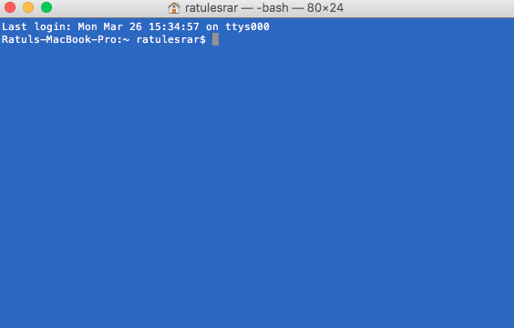
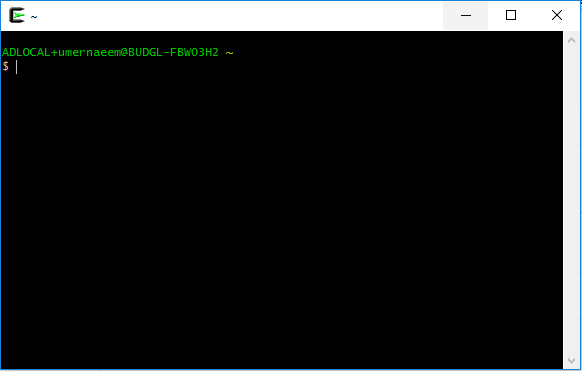
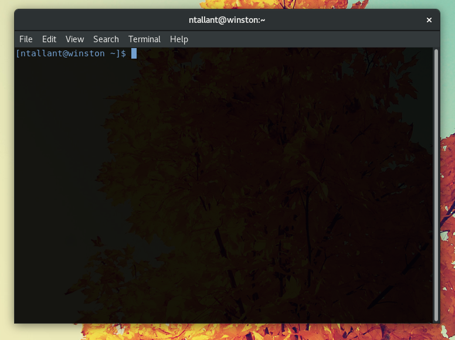

# Overview

## Why learn programming?
### Do things better

* Automation
    * Downloading, merging, and cleaning data
* Speed
* Collaboration using git
* Clarity and reproducibility


### Do new things
* Data sources
    * web APIs, web scraping, databases, geographic data, etc.
* Visualizations
* Models
    * ``machine learning''

### Why now?
* Software is easier and more powerful
* More data is publicly available
    * e.g. municipal data portals
* More organizations are using these tools

## Syllabus

### Administrative
* Course website: [https://harris-ippp.github.io](https://harris-ippp.github.io)
    * Slides, readings, homework assignments
* TAs will host lab sessions in Harris room 224:
    * Mondays 10:30am (Minjia), 4:30pm (Nicholas)
    * Tuesdays 4:30pm (Edric)
    * Wednesdays 9am (Darshan), 1:30pm (Ratul), 3pm (Umer)
* Canvas for discussion and grades


### Curriculum
* Week 1: low level tools (command line) and collaboration (git)
* Weeks 2-4: thinking algorithmically with python
* Weeks 5-10: higher level data analysis, databases, the web

### Assignments
* Posted Thursdays
* Work on and get help in lab the following M-W
* Due (on GitHub) following Thursday by 10:30am
* Reviewed in lab the following week

### Plagiarism policy
* Classmates
    * Discussion encouraged
    * Do not share answers
    * Each student must write their own code
* Internet
    * Websites (e.g. Stack Overflow) are very helpful
    * Make sure you understand what you are copying and pasting
    * Cite anything that you use that is 2 lines or more

### Quizzes
* Weekly quizzes in lecture on Tuesday
    * Hint for next week: review plagarism policy
* On Canvas (so bring a laptop)
* About 5 minutes long

# Command Line

## How does a computer work?

### Hardware


### Software

{ height=75% }

### Operating System

* Does things that the user doesn't need or want to deal with
* Makes system more efficient and convenient
* Intermediary between user and hardware

### Unix

* In the 1970s AT&T Bell Labs developed an operating system called Unix
* The code was licensed to academic (Berkeley) and commercial (IBM, Sun) vendors who created Unix variants
* Today there are many Unix variants
    * Linux
        * Google's Android is based on Linux, making Linux (and Unix) the most popular operating system in the world
    * Mac OS X is also a Unix variant
    * Windows is *not* Unix
        * We'll use Cygwin to provide a "Unix-like" environment

## Command line basics

### Overview

* One of the essential features of Unix for users is its command line (also called shell, prompt, etc.)
* Hides the details of the underlying operating system
* Text interface for navigating files, running programs, etc.
    * Like Finder on OS X or File Explorer on Windows
    * But text-based and much more powerful

### Mac OS X

{ height=75% }

### Windows (Cygwin)
{ height=75% }

### Linux
{ height=75% }

### Anatomy

* The "prompt" is where you enter text
    * Typically ends in a `$`
    * Contains information about the username, the system name, and the current directory.

* The character `~` is an alias for your home directory.

```bash
eric@laptop:~$


```

### `cd`

* To **c**hange **d**irectories, use the `cd` command:

```bash
eric@laptop:~$ cd harris-ippp
eric@laptop:~/harris-ippp$


```

### More aliases

* The parent directory has alias `..`:
```bash
eric@laptop:~/harris-ippp$ cd ..
eric@laptop:~$


```

* The current directory has alias `.`:
```bash
eric@laptop:~$ cd .
eric@laptop:~$


```

### `ls`

The `ls` command lists files and directories:

```bash
eric@laptop:~/harris-ippp/lectures-s18/01$ ls
01.md  01.pdf  hardware.png  os.png  osx-terminal.png
eric@laptop:~/harris-ippp/lectures-s18/01$


```

### `ls` options

* Note that from now on for readability we'll typically omit the current directory from terminal examples
* To list more information, including file sizes, use option `-o`:

```bash
$ ls -o
total 336
-rw-r--r-- 1 eric   5756 Mar 26 15:55 01.md
-rw-r--r-- 1 eric 278540 Mar 26 15:54 01.pdf
-rw-r--r-- 1 eric  21843 Mar 14 12:58 hardware.png
-rw-r--r-- 1 eric  12677 Mar 14 13:10 os.png
-rw-r--r-- 1 eric  10845 Mar 26 15:37 osx-terminal.png

```

### More `ls` options
* To use "human readable" file sizes use option `-oh`:
```bash
$ ls -oh
total 340K
-rw-r--r-- 1 eric 6.0K Mar 26 16:01 01.md
-rw-r--r-- 1 eric 276K Mar 26 16:00 01.pdf
-rw-r--r-- 1 eric 4.0K Mar 26 15:56 cygwin-terminal.png
-rw-r--r-- 1 eric  22K Mar 14 12:58 hardware.png
-rw-r--r-- 1 eric  13K Mar 14 13:10 os.png
-rw-r--r-- 1 eric  11K Mar 26 15:37 osx-terminal.png

```

### `ls` arguments
To only include `png` (image) files:
```bash
$ ls -oh *.png
-rw-r--r-- 1 eric 4.0K Mar 26 15:56 cygwin-terminal.png
-rw-r--r-- 1 eric  22K Mar 14 12:58 hardware.png
-rw-r--r-- 1 eric  13K Mar 14 13:10 os.png
-rw-r--r-- 1 eric  11K Mar 26 15:37 osx-terminal.png

```


### Syntax
More generally, command line programs have the following *syntax*:
```bash
$ program --flag -a -b -c arg1 arg2

```
where:

* `--flag` is a long option (or flag)
* `-a`, `-b`, `-c` are short option, e.g. `-o`, `-h`
    * They can usually be combined so `-o -h` is the same as `-oh`
* `arg1`, `arg2` are arguments, e.g. `*.csv`

### File management commands

:::incremental
* `ls`: list contents of current directory
* `pwd`: print current working directory
* `cd`: change directory
* `mkdir`: make new directory
    * `mkdir dirname`
* `cp`: copy
    * `cp original_filename new_filename`
    * `cp -r original_dirname new_dirname`
* `rm`: remove (use with caution!)
    * `rm filename`
    * `rm -r dirname`
:::

### Manuals
* Almost all command line programs come with a help file, called a "man page" (short for manual)
* `man` is itself a program whose argument is the name of the program to show the manual for:

```bash
$ man ls


```

### `man` example
* The output of `man` is interactive, use keyboard shortcuts: up/down arrows scroll and `q` quits.

{ height=60% }

## More advanced commands

### More advanced commands

:::incremental
* `curl`: download files from the web
* `cat, head, tail`: print a file or part of one
* `less`: page through a file
* `grep`: search for lines in a file
* `sed`: find and replace
* `wc`: count words or lines in a file
* `sort`: sort a file
* `cut`: choose specific columns in a file (e.g. a csv)
* `uniq`: with `-c`, print number of occurrences of a line
* `python`: much more on this one soon
:::

### curl

* `curl` downloads web pages and other web resources
```bash
$ curl https://data.cityofchicago.org/api/views/xzkq-xp2w/rows.csv
  -o salaries.csv
```
* The `-o` option allows specifying the output filename

### `cat`, `head`, `tail`, `less`

* `cat` prints a file
```bash
$ cat salaries.csv
```
* For very large files this is slow so it's useful to print just a subset.
* First 42 lines:
```bash
$ head -42 salaries.csv
```
* Last 12 lines:
```bash
$ tail -12 salaries.csv
```
* To interactively scroll (`h` for help, `q` for quit):
```bash
$ less salaries.csv
```

### `wc`
* `wc -l` counts the number of lines in a file:
```bash
$ wc -l salaries.csv
```

### `grep`
* The `grep` program filters a file, printing those lines that match a given pattern
* For example, to find all rows in the salaries file containing the text `'EMANUEL'` (as in mayor Rahm Emanuel):
```bash
$ grep EMANUEL salaries.csv
```

### `grep` regular expressions
* What about more complicated searches?
* Regular expressions are special strings that match complex patterns
* They make `grep` very, very powerful

###  `grep` regex example
* For example, this regex only matches lines with 6 consecutive numbers, i.e. six-figure salaries:
```bash
$ grep '[0-9]\{6\}' salaries.csv
```
* `[0-9]` matches any number
* `[0-9]{6}` matches 6 numbers in a row
    * However, the curly braces `{}` need to be "escaped", i.e. preceeded by a backslash `\`
    * "Escaping" special characters is an annoying but common occurence in programming

### Redirection and Pipes
* The power of the command line lies in quickly composing programs from these building blocks
* You can compose programs in two basic ways:
    * Redirect (`>`): write output from a command to a file
    * Pipe (`|`): forward output from one command to another

### Redirection

* Save output of a command to a new file using the redirect `>`:
```bash
$ grep '[0-9]\{6,\} salaries.csv > salaries6.csv
```


### Pipes
* Many commands can take input from another command instead of from a file.

* For example, start by getting all rows for police officers:
```bash
$ grep "POLICE OFFICER" salaries.csv
```

* Then to count the number of police officers we *pipe* to `wc -l`:
```bash
$ grep "POLICE OFFICER" salaries.csv | wc -l
```

## Scripts

### Why?
* Executing the above "one-off" commands can get complicated
* What if you want to regularly re-download the salaries dataset and count the number of police officers?
* You need to write a script (or program)

### Example
* Use a text editor (e.g. Atom) to create and save the script in a file called `police_count.sh`:
```bash
grep "POLICE OFFICER" salaries.csv | wc -l
```
* The `sh` suffix stands for *shell*

### Interpreter
* Now *execute* the script with the `sh` program:
```bash
$ sh police_count.sh
``` 
* `sh` is the shell interpreter program
* This program reads your code line-by-line and executes it

### Comments
* One upshot of writing scripts is *comments*:
```bash
grep "POLICE OFFICER" salaries.csv | # filter 
    wc -l
```

* Everything after the `#` (hash sign) is a comment and does not get executed
* Comments allow you to *document* your code, explaining it to others (and yourself)
* They are essential to good code (and 25% of your grade)

### Bigger example
* For a more complicated example, this is how we can find the 5 departments with the largest number of employees
```bash
cut -d, -f4 salaries.csv | # print departments column
    sort | # sort (alpha)
    uniq -c | # count each department
    sort -n | # sort numeric (ascending)
    tail -5 # print last 5 lines
```

### Summary

:::incremental
* Command line is a quick and (once you're comfortable) easy way to navigate data on your computer
* But it can be cumbersome-- you might be thinking "This is easier in Excel"
    * The fact is that some individual tasks *are* easier in Excel (or Stata, etc.)
    * Knowing the right tool for the job is an essential part of progamming
    * Command line is more reproducible, more portable, and generally very efficient (i.e. fast)
:::

### Looking forward
* In the remainder of the course we'll focus on python
* But command line will remain relevant in two ways:
    * It is essential for navigating your computer and executing python code and git
    * The tools we've covered (`grep`, `wc`, `curl`, etc.) will remain important for a fast and efficient first pass in data analysis
