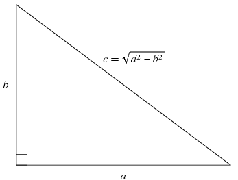

# Functions

## Function composition

```python
>>> math.exp(math.log(5))
5.0
```

## Adding new functions
Define a new function using the `def` keyword:
```python
def hello():
    print('Hello, World')

hello()
```

## Parameters

The inputs to a function are called *parameters*. For example:
```python
math.sqrt(2)
```
2 is a parameter

## Arguments
To define a function that "takes" parameters:
```python
def hello(name):
    print('Hello, ' + name)

hello('John')
```

* The variable `name` is called an *argument* to the function.
* The parameter `'John'` gets assigned to the argument `name`.

## Parameters are local
Argument and variable names used inside a function stay inside that function:
```python
def hello(name):
    print('Hello, ' + name)

hello('Jane')
print(name)
```

```python
NameError: name 'name' is not defined
```

## Multiple arguments
Functions can have multiple arguments, separated by commas:
```python
def hello(greeting, name):
    print(greeting + ', ' + name)

hello('Bonjour', 'Jean')
```

## Return values
* Math functions like `exp`, `log`, etc. all produce an output/result.
* This is called a return value and your functions can return using the keyword `return`:

```python
def hello(name):
    return 'Hello, ' + name

hello_john = hello('John')
```

## Default return value
* Note that if a function does not explicitly return a value, it returns a special value `None`:
```python
def hello():
    print('Hello, World')

hello_return = hello()
print(hello_return)
```

## Why functions?

* Functions are a part of "good code"
* They make your code more clear
* They also make it more "modular"

## Pythagorean theorem
{ height=33% }

Calculate the length of the hypotenuse of a triangle:
```python
import math

math.sqrt(3**2 + 4**2)
math.sqrt(1**2 + 1**2)
math.sqrt(5**2 + 12**2)
```

## Pythagorean theorem refactored
```python
import math

def hypotenuse(a, b):
    return math.sqrt(a**2 + b**2)

hypotenuse(3,4)
hypotenuse(1,1)
hypotenuse(5,12)
```

# Input

## Keyboard input
Use the `input` function to read text input in your program:
```python
# hello_input.py
name = input()
print('Hello, ' + text)
```

```bash
$ python hello_input.py
Eric
Hello, Eric
```

## Keyboard input prompt
The `input` function takes one *optional* `prompt` parameter:
```python
# hello_prompt.py
name = input("Name: ")
print('Hello, ' + name)
```

```bash
$ python hello_prompt.py
Name: Eric
Hello, Eric
$ 
```

# Incremental Development

## Introduction

* *Incremental development* is a process for dealing with complex code
    * Add only a small amount of code at a time
    * That way you can test it bit-by-bit
* A related concept is a "minimum working example"
* Reference: Think Python, Chapter 6

## Example: distance function
Let's implement the formula for calculating the distance between two points in the plane:

\begin{equation}
    distance = \sqrt{(x_2 - x_1)^2 + (y_2 - y_1)^2}
\end{equation}

## Step 1: Define the function
* The function should take four arguments: `x1,y1,x2,y2`
* The function should return a floating-point (decimal) value

```python
def distance(x1, y1, x2, y2):
    return 0.0
```

## Testing function definition
```python
>>> distance(1,2,4,6)
0.0
```
* The function call and return are working
* But the answer is obviously wrong (correct answer is 5)

## Step 2: Calculate differences
```python
def distance(x1, y1, x2, y2):
    dx = x2 - x1
    dy = y2 - y1

    print('dx is', dx)
    print('dy is', dy)

    return 0.0
```

```python
>>> distance(1,2,4,6)
dx is 3
dy is 4
0.0
```

## Step 3: Sum of squares
```python
def distance(x1, y1, x2, y2):
    dx = x2 - x1
    dy = y2 - y1

    dsquared = dx**2 + dy**2
    print('dsquared is', dsquared)

    return 0.0
```

## Step 4: Distance
```python
import math

def distance(x1, y1, x2, y2):
    dx = x2 - x1
    dy = y2 - y1

    dsquared = dx**2 + dy**2
    return math.sqrt(dsquared)
```


# Conditions

## Booleans
* Consider the python expression `x > 0`.
* This has a type called "boolean" and can take only two values: `True` or `False`.
* Other boolean operators include:
    * Equals (`==`), as in `1 == 1`
    * Not equals (`!=`) as in `'a' != 'b'`

## Conditions: `if`
Boolean logic can be used to control program execution through the `if` statement:
```python
if (x < 0):
    print('Negative')
```

## Conditions: `else`
Use `else` to execute code when the condition is `False`:
```python
if (x < 0):
    print('Negative')
else:
    print('Non-negative')
```

## Conditions: `elif`
```python
if (x < 0):
    print('Negative')
elif (x == 0):
    print('Zero')
else:
    print('Positive')
```

## Modulo
Another related operator is modulo (`%`). This operator returns the remainder when one number is divided by another:

`a % b` is the remainder when `a` is divided by `b`

For example:

* 5 % 3 = 2, because 5 divided by 3 is 1 with remainder *2*
* 10 % 3 = 1, because 10 divided by 3 is 3 with remainder *1*
* 4 % 2 = 0, because 4 divided by 2 is 2 with remainder *0*

## Even-odd
We can use modulo (`%`) to determine whether a number is even or odd by checking whether it is divisible by 2:
```python
if (x % 2 == 0):
    print('Even')
else:
    print('Odd')
```

## Boolean operators
We often want to combine booleans. For example, we might ask of a person:

* Do they speak English *and* Russian?
* Do they speak French *or* Chinese?
* Do they speak *not* speak Spanish?

## Boolean operators in Python
Those are the three basic boolean operators:

* `and`: `True` if both parameters are `True`
    * ```a and b``` where `a` and `b` are booleans
* `or`: `True` if at least one parameter is `True`
    * ```a or b```
    * Note that it's not "either-or", i.e. `True or True` is `True`
* `not`: the opposite of the argument
    * `not a`

## Boolean logic
* Boolean logic (`and`, `or`, `not`) is fundamental to how computers work.
* In fact, all operations (e.g. arithmetic) on a computer can be expressed in boolean logic.

## More string functions
:::incremental
* `string.endswith(ending)`: does `string` end in `ending`?
* `string.startswith(beginning)`: does `string` start with `beginning`?
* `substring in string`: does `string` contain `substring`?
* `string.find(substring)`: what is the (first!) index of `substring` in `string`? (or -1 if `substring not in string`)
:::

## Raising errors
* You can trigger your own errors using the `raise` keyword
* The most common type of error is a `ValueError`:

```python
price = input('Price: ')
if price <= 0:
    raise ValueError('price must be non-negative!')
```

## String parsing
The process of reading through a string to break it down or interpret it is called *parsing*.

* Command line programs do this in order to interpret options and arguments
* Python does this to execute your code
* Google does it to execute a search query
* Etc.

## String parsing example
```python
city_state = 'Chicago, IL'

if ',' not in city_state: # substring
    raise ValueError('no comma')

comma_index = city_state.find(',')
city = city_state[:comma_index]
state = city_state[comma_index+2:]

if len(state) != 2:
    raise ValueError('invalid state abbrev: ' + state)

print('City:', city)
print('State:', state)
```

## Summary
:::incremental
* Complex programs are easier to read and write using functions
* Use the `input` function to make interactive programs
* Incremental development makes debugging easier
* Use the `if` statement to execute code under certain conditions
* Use boolean logic to express those conditions
:::
