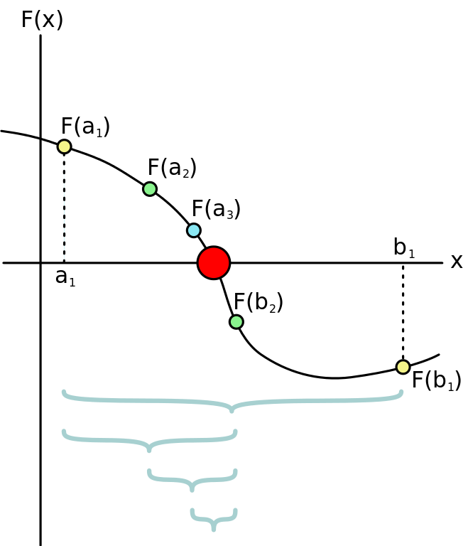

# Iteration

## Multiple Assignment

```python
a = 1
b = a # a and b are now equal
a = 2 # not anymore
```

## Updating a variable
```python
i = 1     # initialization
i = i + 1 # update
```
## What is iteration?
* Computers are good at automating repetitive tasks
* There are two basic commands in python for iteration: `while` and `for`

## `while`
```python
# blastoff.py
n = 3
while n > 0:
    print(n)
    n = n - 1
print 'Blastoff!'
```

```bash
$ python blastoff.py
3
2
1
Blastoff
```
Think Python, p. 77

## While anatomy
```python
while condition:
    # body
```
1. Evaluate the condition, yielding `True` or `False`
2. If the condition is `False`, exit the `while` loop
3. If the condition is `True`, execute body and return to 1.

This flow is called a *loop* because step 3 goes back to step 1.

## While in a function
```python
def sequence(n):
    while n > 0:
        print(n)
        n = n - 1
    print 'Blastoff!'
```

## Modules
```python
# blastoff.py
def sequence(n):
    while n > 0:
        print(n)
        n = n - 1
    print 'Blastoff!'
```

```bash
$ python
>>> import blastoff
>>> blastoff.sequence(3)
```

## Infinite loop
If a loop runs forever without terminating it is called an *infinite loop*. For example:

```python
while True:
    print('Hello, World')
```

Use the keyboard shortcut `Ctrl+C` to terminate the program.

## Another infinite loop
```python
i = 1
while i > 0:
    print(i)
    i = i + 1
```

## `break`
To exit a loop while from the body use the `break` keyword:

```python
# echo.py
while True:
    line = input('> ')
    if line == 'done':
        break
    print(line)

print('Done!')
```

# Algorithms

## Numerical approximation
Loops are useful for calculations where we start with an approximate answer and iteratively improve it.

## Bisection search
Bisection search is an iterative algorithm for finding the solution to an equation $F(x) = 0$.

Intuitively:

:::incremental
* Start with an interval
* Keep shrinking the interval until we've isolated a solution
:::

## Bisection method illustrated
{ height=75% }


## Bisection search in detail
:::incremental
1. Start with an interval $[a,b]$ on which $F(a) > 0$ and $F(b) < 0$
2. *Bisect* the interval: $c = \frac{a + b}{2}$
3. Three possibilities:
    - If $F(c) = 0$ we're done
    - Else if $F(c) < 0$, continue looking in $[a,c]$
    - Else ($F(c) > 0$), continue looking in $[c,b]$
:::

## Bisection search pseudo-code
Assuming $F(a) > 0$ and $F(b) < 0$, i.e. $F$ is decreasing on the initial interval:

```python
while True:
    c = (a + b)/2

    if F(c) == 0:
        break
    elif F(c) < 0:
        b = c # replace interval with left half
    else:
        a = c # replace interval with right half
```

## Square root
* We can apply the bisection search to estimate the square root of 2
    * This is just an exercise, python has a built-in `math.sqrt` function
* Then our function is $F(x) = x^2 - 2$
* Start by setting $a$ and $b$:
    * $a = 0$
    * $b = 2$

## Python square root
```python
a = 0
b = 2

while True:
    c = (a + b)/2
    Fc = c**2 - 2

    if Fc == 0:
        break
    elif Fc < 0:
        a = c
    else:
        b = c

print(c)
```

## Floating point equality
:::incremental
* The above code results in an infinite loop!
* The reason is that `Fc != 0`, i.e. $Fc$ never equals *exactly* zero
* This is an issue of floating point (decimal) arithmetic on a computer
:::

## Debugging: Add a print statement
```python
a = 0
b = 2

while True:
    c = (a + b)/2
    Fc = c**2 - 2
    print(c, Fc)

    if Fc == 0:
        break
    elif Fc < 0:
        b = c
    else:
        a = c

print(c)
```

## Debugging output `(c, Fc)`
```bash
1.414213562373095 -4.440892098500626e-16
1.414213562373095 -4.440892098500626e-16
1.414213562373095 -4.440892098500626e-16
1.414213562373095 -4.440892098500626e-16
1.414213562373095 -4.440892098500626e-16
1.414213562373095 -4.440892098500626e-16
1.414213562373095 -4.440892098500626e-16
1.414213562373095 -4.440892098500626e-16
1.414213562373095 -4.440892098500626e-16
```

## Floating point approximate equality
The solution is to test for `Fc` being small:
```python
if abs(Fc) < .00001:
    break
```

## Python square root
```python
a = 0
b = 2

while True:
    c = (a + b)/2
    Fc = c**2 - 2

    if abs(Fc) < .00001:
        break
    elif Fc < 0:
        a = c
    else:
        b = c

print(c)
```

## Square root function
```python
# mymath.py
def sqrt(x):
    a = 0
    b = x
    
    while True:
        c = (a + b)/2
        Fc = c**2 - x
        
        if abs(Fc) < .00001:
            return c
        elif Fc < 0:
            a = c
        else:
            b = c
```

## Square root function call
```bash
$ python
>>> import mymath
>>> mymath.sqrt(2)
```

# `for`

## string `len`
You can find the length of a string using the `len` function:
```python
message = 'Hello, World'
len(message)
```
## `while` over string
We can use `while` to loop over characters in a string:

```python
message = 'Hello, World'
i = 0
while i < len('Hello, World'):
    letter = message[i]
    print(letter)
    i = i + 1
```

## `for` example
This is cleaner with `for` loops:

```python
message = 'Hello, World':
for letter in message:
    print(letter)
```

## Counting
This example counts the number of times the letter `a` appears in a string:
```python
word = 'banana'
count = 0
for letter in word:
    if letter == 'a':
        count = count + 1
print(count)
```

## Lists
Strings are sequences of words but what about sequences of numbers? For that we use lists:

```python
>>> a = [1,2,3,4]
>>> a[1]
2
>>> a[2]
3
>>> a[-1]
4
```

## Mixed-type lists
Lists can contain any types:
```python
[1, 2, 'a', 'b']
[1.0, 'apple', 'banana']
```

## Iterating over a list
We can iterate over a list just like over a string, using a `for` loop:
```python
numbers = [1, 2, 3, 4, 5, 6]
for x in numbers:
    print(x, 'squared is', x**2)
```

## `range` function
To iterate over sequences of numbers without explicitly defining a list use the `range` function:
```python
>>> for x in range(5):
...     print(x)
...
0
1
2
3
4
```
Range iterates from 0 to *4*.

## `range` second argument
With two arguments you can set the `start` and `stop` of `range`:
```python
>>> for x in range(5,10):
...     print(x)
...
5
6
7
8
9
```

## `range` third argument
With a third argument you can also specify the `step`:
```python
>>> for x in range(10,55,10):
...     print(x)
...
10
20
30
40
50
```
