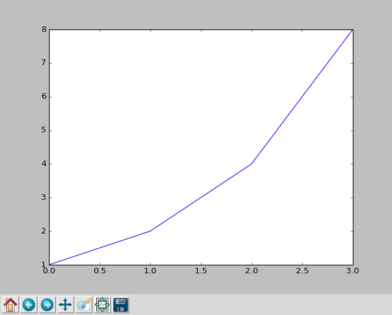
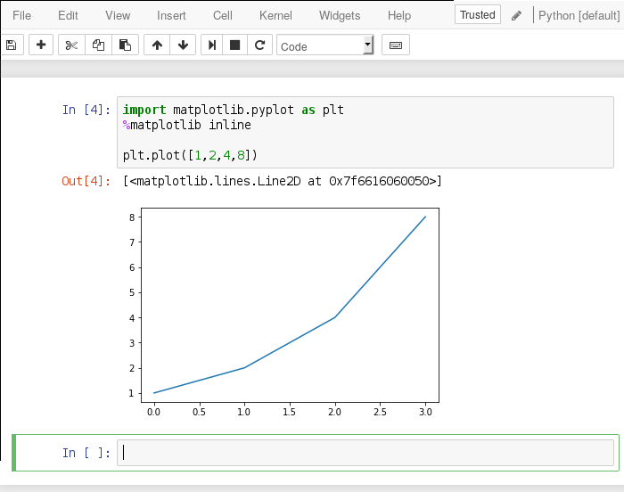
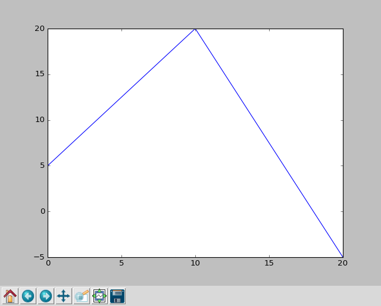
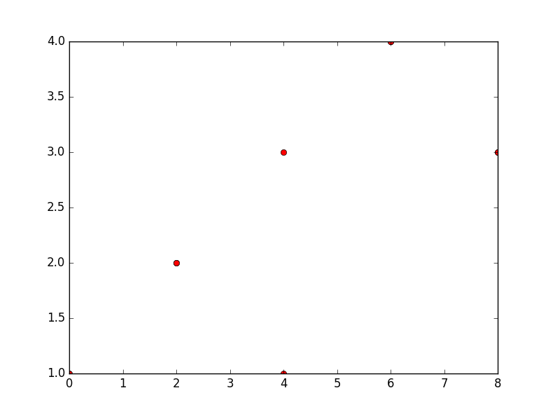
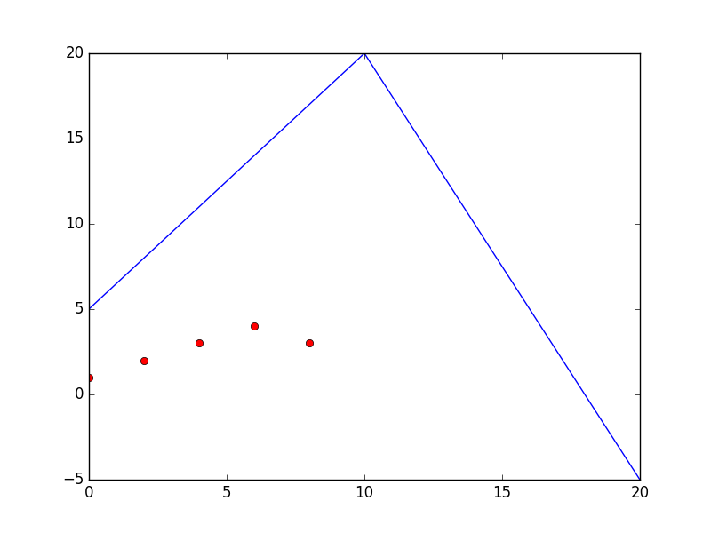
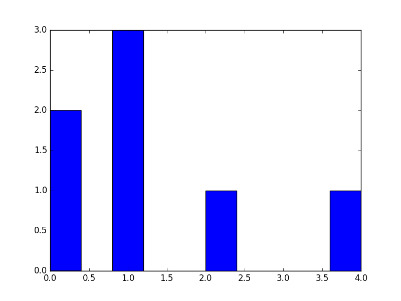
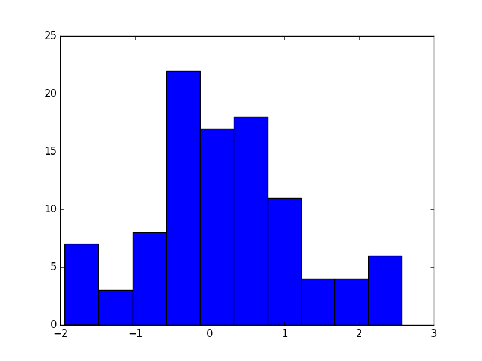
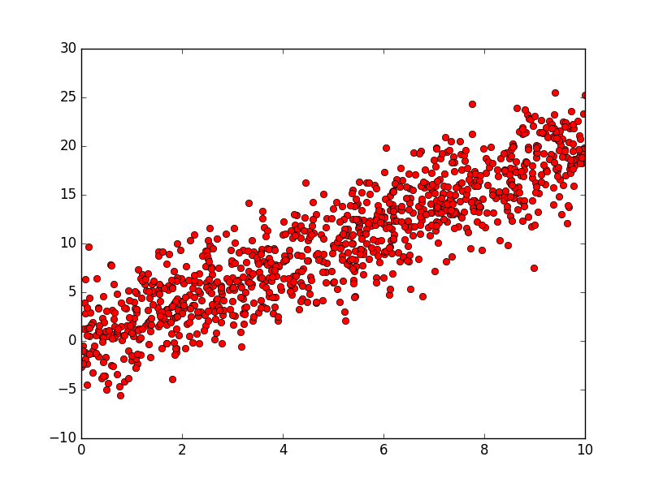
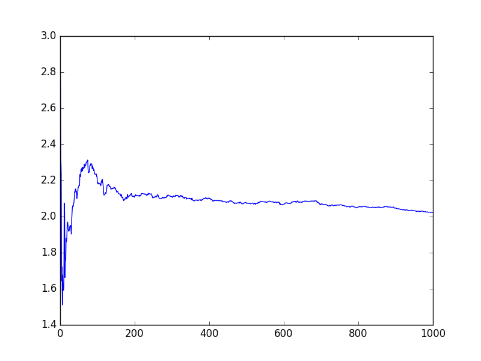

# Randomness
## Random numbers

In statistics we sample a random variable $X$ with, say, a Bernoulli distribution with $p=.5$ representing a fair coin flip:

$$ P(X=0) = .5 $$
$$ P(X=1) = .5 $$

## Random number generator
A random number generator is a computer program that that samples from a probability distirbution.

## NumPy library

:::incremental
* NumPy (short for Numerical Python) is a numerical module for python. It provides many useful features, including random number generation.

* To use NumPy we import it. While we could simply do

    ```python
    import numpy
    ```

* It is common practice to use

    ```python
    import numpy as np
    ```
:::

## Random [0,1]
To generate a random `float` between 0 and 1 use `np.random.random()`:
```python
>>> import numpy as np
>>> np.random.random()
0.45986965699341753
```

## Multiple draws
```python
>>> import numpy as np
>>> np.random.random()
0.45986965699341753
>>> np.random.random()
0.5894272144763195
>>> np.random.random()
0.32955445470728895
```

## Random Bernoulli

:::incremental
* We can transform a random number from 0 to 1 into a Bernoulli distribution with $p=.5$:

    ```python
    x = np.random.random()
    if x > .5:
        y = 1
    else:
        y = 0
    ```

* Technically you could apply other transformations to `np.random.random()` to sample from *any* distribution.

* But in practice we use specialized NumPy functions for each distribution:

    ```python
    np.random.binomial(1, .5)
    ```
:::


## Random integer
```python
>>> np.random.randint(0, 10)
3
```
The parameters to `randint` are `low` (inclusive) and `high` (exclusive).

## Random normal
:::incremental
* By default `np.random.normal` is the standard (mean 0, variance 1) normal:

    ```python
    >>> np.random.normal()
    -0.27054108268825433
    ```

* You can pass a `location` (mean) and `shape` (standard deviation) parameter:

    ```python
    >>> np.random.normal(10,2)
    11.88791395360905
    ```
:::

## Random permutation

```python
>>> np.random.permutation(10)
array([4, 8, 5, 1, 7, 9, 2, 3, 0, 6])
```

## Random seed
:::incremental
* Sometimes it can be useful for the "random" numbers to be deterministic. You can achieve that by setting the random seed:

    ```python
    >>> np.random.seed(42)
    >>> np.random.random()
    0.3745401188473625
    >>> np.random.random()
    0.9507143064099162
    >>> np.random.random()
    0.7319939418114051
    ```

* Every time you run this code it will produce the same "random" numbers
:::

# Plotting

## Matplotlib
* Matplotlib is a python module for plotting
* It has a *submodule* called `pyplot` that provides an (relatively) easy interface to the most common plotting functions

## Plot a sequence
* You can plot the sequence `[1,2,3,4]`:

```python
>>> import matplotlib.pyplot as plt
>>> plt.plot([1,2,3,4])
```

## `show`
To actually see what you've plotted use the `show` function:
```python
>>> import matplotlib.pyplot as plt
>>> plt.plot([1,2,4,8])
>>> plt.show()
```

{ height=50% }

## `savefig`

Alternatively, save the figure to a file:
```python
>>> import matplotlib.pyplot as plt
>>> plt.plot([1,2,4,8])
>>> plt.savefig('plot.png')
```
Matplotlib will determine which format to use from the file extension (`png`, `pdf`, etc.)

## Jupyter
Use the "magic" command %matplotlib inline to simply have your plots appear inline in a Jupyter notebook:

{ heigher=75%}

## Line plot
With two arguments, you can specify the x and y coordinates:

```python
plt.plot([0,10,20], [5, 20, -5])
```

{ height=75% }

## Formatting
* You can remove the lines and only show points using a format parameter which is a string.
* The default format string is `'b-'`, in which the `'b'` is the color blue and the `'-'` represents a line.
* We can intsead plot red circles using the format string `'ro'`
* See [`plot` documentation](https://matplotlib.org/api/pyplot_api.html#matplotlib.pyplot.plot) for more on formatting.

## Scatter plot

```python
plt.plot([0,2,4,6,8], [1,2,3,4,3], 'ro')
```

{ height=75% }

## Multiple plots
Multiple plots (before calling `show()` or in the same cell in Jupyter) will appear together. To clear the figure use `plt.clf()`.

```python
plt.plot([0,10,20], [5, 20, -5])
plt.plot([0,2,4,6,8], [1,2,3,4,3], 'ro')
```

{ height=50% }


## Histogram
You can plot a histogram of a list of values:
```python
plt.hist([0,1,1,0,1,2,4])
```



## Probability distribution
```python
xs = []
for i in range(100):
    xs.append(np.random.normal())

plt.hist(xs)
```

{height=50%}

## More matplotlib
Next week we'll see more options including axis labels, titles, etc.

# Simulation

## Linear model
Given a slope $\beta$, consider the *data generating process*

$$ y = \beta x + \epsilon $$

where $\epsilon$ is a standard normal error term:

$$ \epsilon \sim Normal(0,1) $$

## Sampling

Given a point $x$, we can sample $y$ by first sampling a random $\epsilon$ and then adding it to $\beta x$.

```python
beta = 2
x = 1

epsilon = np.random.normal()
y = beta*x + epsilon
```

## Sampling x
We can also sample $x$. For example we can make $x$ uniform over some interval $[a, b]$:

```python
beta = 2
a = 0
b = 10

x = np.random.uniform(a, b)

epsilon = np.random.normal()
y = beta*x + epsilon
```

## Many samples
We can get many samples in a loop:

```python
beta = 2
a = 0
b = 10

xs = []
ys = []

for i in range(1000):
    x = np.random.uniform(a, b)
    epsilon = np.random.normal(0, 3)
    y = beta*x + epsilon
    
    xs.append(x)
    ys.append(y)

plt.plot(xs, ys, 'ro')
```

## Regression samples plot

{ height=75% }

## Covariance
* We can use `np.cov` to calculate the covariance matrix for a sample of `xs` and `ys`:

    ```python
    >>> cov = np.cov(xs, ys)
    >>> cov
    array([[  8.03709644,  15.72876449],
           [ 15.72876449,  31.79094298]])
    ```

* It's a 2d array (list):
    * `cov[0][0]` is the *variance* of `xs`
    * `cov[1][1]` is the variance of `ys`
    * `cov[0][1] == cov[1][0]` is their covariance

## Regression
* Recall that the regression of $y$ on $x$ estimates

    $$\hat\beta = Cov(x,y) / Var(x) $$

* So in code we can write
```python
>>> beta_hat = cov[0][1] / cov[0][0]
>>> beta_hat
2.0235487499138292
```

## Sample size
We can repeat this over subsets of the data:

```python
beta_hats = []
for i in range(1,1001):
    cov = np.cov(xs[:i+1], ys[:i+1])
    beta_hat = cov[0][1] / cov[0][0]
    beta_hats.append(beta_hat)
```

## Plot estimates

{ height=75% } 
