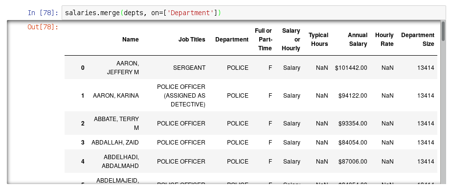
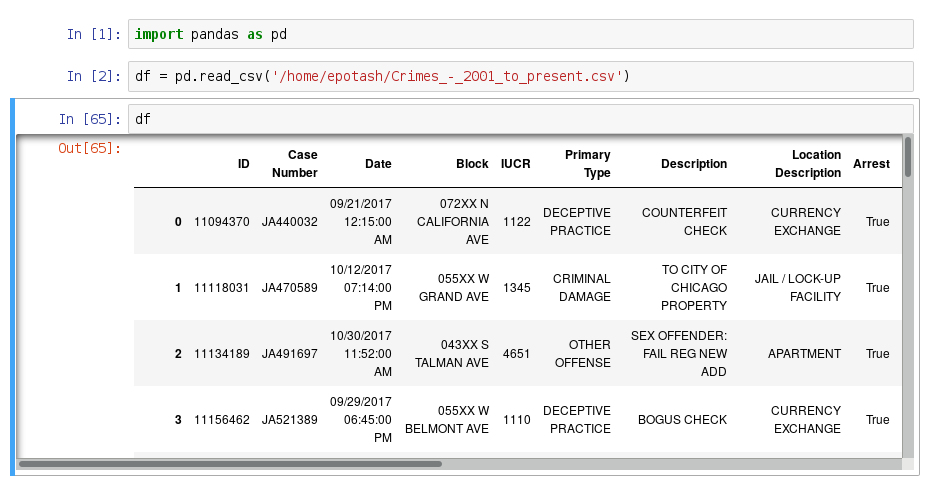
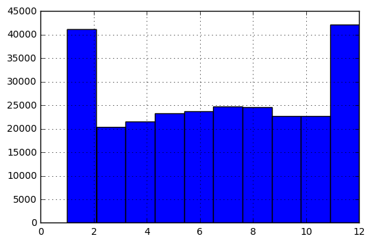
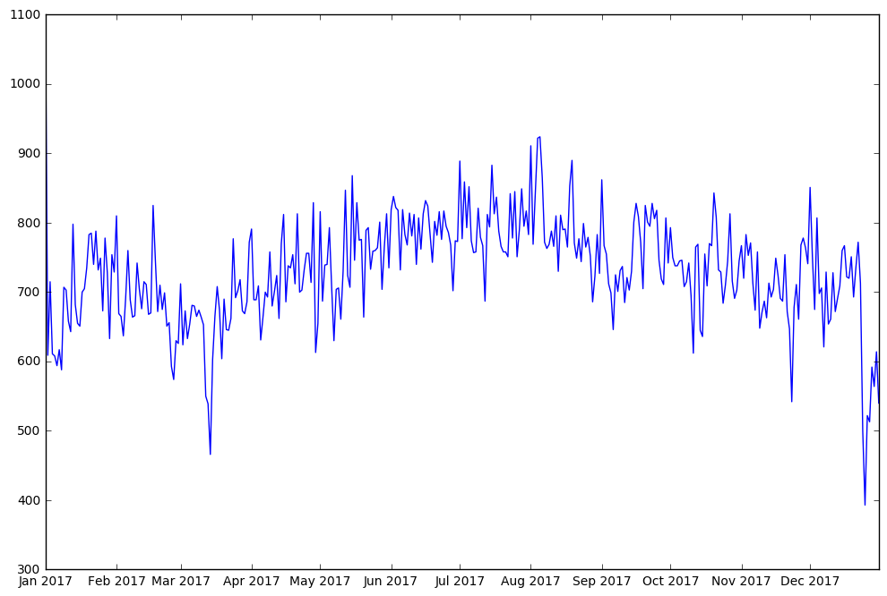

# Combining and Merging

## State-year data

```python
>>> state_years = pd.DataFrame({
        'state': ['Ohio', 'Ohio', 'Ohio', 
                  'Nevada', 'Nevada'],
        'year': [2000, 2001, 2002, 2001, 2002],
        'pop': [1.5, 1.7, 3.6, 2.4, 2.9]
    })
>>> state_years
   pop   state  year
0  1.5    Ohio  2000
1  1.7    Ohio  2001
2  3.6    Ohio  2002
3  2.4  Nevada  2001
4  2.9  Nevada  2002
```

## State data

```python
>>> states = pd.DataFrame({
        'state':['Ohio', 'Utah'],
        'abbrev': ['OH', 'UT'],
        'area': [4.4, 11.0]
    })
>>> states
  abbrev  area   state
0     OH   4.4    Ohio
1     UT  11.0    Utah
```

## Merge

The `merge` function allows us to combine two datasets that share a column:

```python
>>> state_years.merge(states, on='state')
   pop   state  year abbrev  area
0  1.5    Ohio  2000     OH   4.4
1  1.7    Ohio  2001     OH   4.4
2  3.6    Ohio  2002     OH   4.4
```

* The `state` column is called the merge *key*
* The `state_years` table is called the *left* and `states` is called the *right*
* The rows corresponding to Nevada and Utah don't appear in the result because the `merge` function performs an *inner* merge by default.

## Merge `how`

* Four ways to merge datasets: inner, outer, left, and right.
* They differ in how they treat rows that are not shared by both *left* and *right* tables.
* The default is an *inner* merge
    * Its result only includes rows that are in both left and right.
* All other merge types produce results that are supersets of the inner merge.

## Merge `how` Venn diagrams

{ height=50% }

## Inner 

Again, an inner merge (the default) only includes rows that are present on both sides of the merge:
```python
>>> state_years.merge(states, on='state', how='inner')
   pop   state  year abbrev  area
0  1.5    Ohio  2000     OH   4.4
1  1.7    Ohio  2001     OH   4.4
2  3.6    Ohio  2002     OH   4.4
```

## Left

A left merge includes all rows from the left table, producing nulls when a key is missing on the right:
```python
>>> state_years.merge(states, on='state', how='left')
   pop   state  year abbrev  area
0  1.5    Ohio  2000     OH   4.4
1  1.7    Ohio  2001     OH   4.4
2  3.6    Ohio  2002     OH   4.4
3  2.4  Nevada  2001    NaN   NaN
4  2.9  Nevada  2002    NaN   NaN
```

## Right

A right merge includes all rows from the right table, producing nulls when a key is missing on the left:
```python
>>> state_years.merge(states, on='state', how='right')
   pop state    year abbrev  area
0  1.5  Ohio  2000.0     OH   4.4
1  1.7  Ohio  2001.0     OH   4.4
2  3.6  Ohio  2002.0     OH   4.4
3  NaN  Utah     NaN     UT  11.0
```

Note that `A.merge(B, how='right')` is equivalent to `B.merge(A, how='left')`

## Outer

An outer merge includes all rows, producing nulls when a ket from the left is missing on the right and vice versa:

```python
>>> state_years.merge(states, on='state', how='outer')
   pop   state    year abbrev  area
0  1.5    Ohio  2000.0     OH   4.4
1  1.7    Ohio  2001.0     OH   4.4
2  3.6    Ohio  2002.0     OH   4.4
3  2.4  Nevada  2001.0    NaN   NaN
4  2.9  Nevada  2002.0    NaN   NaN
5  NaN    Utah     NaN     UT  11.0
```


## Another merge

Load the salaries file again:

```python
>>> salaries = pd.read_csv('salaries.csv')
>>> dept_sizes = salaries.Department.value_counts()
>>> dept_sizes
POLICE                   13414
FIRE                      4641
STREETS & SAN             2198
OEMC                      2102
WATER MGMNT               1879
AVIATION                  1629
TRANSPORTN                1140
PUBLIC LIBRARY            1015
GENERAL SERVICES           980
FAMILY & SUPPORT           615
FINANCE                    560
HEALTH                     488
...
```

## `to_frame()`
The `merge()` function only operates on DataFrames. By "resetting" the index, the series becomes a data frame:

```python
>>> depts = dept_sizes.reset_index()
                    index  Department
0                  POLICE       13414
1                    FIRE        4641
2           STREETS & SAN        2198
3                    OEMC        2102
4             WATER MGMNT        1879
5                AVIATION        1629
6              TRANSPORTN        1140
7          PUBLIC LIBRARY        1015
8        GENERAL SERVICES         980
9        FAMILY & SUPPORT         615
...
```

## Rename columns

But the column names are confusing. Rename them:

```python
>>> depts.columns
Index(['index', 'Department'], 
      dtype='object')
>>> depts.columns = ['Department', 'Department Size']
>>> depts.columns
Index(['Department', 'Department Size'],
      dtype='object')
>>> depts
               Department  Department Size
0                  POLICE            13414
1                    FIRE             4641
2           STREETS & SAN             2198
3                    OEMC             2102
4             WATER MGMNT             1879
5                AVIATION             1629
...
```

## Merge department sizes



# Data Transformations

## `cut()`
```python
>>> salaries['salary'] = \
        salaries['Annual Salary'].str[1:].astype(float)
```

```python
>>> pd.cut(salaries['salary'],
           [0, 100000, 200000, 300000])
33176         (0, 100000]
33177         (0, 100000]
33178         (0, 100000]
33179         (0, 100000]
33180         (0, 100000]
33181         (0, 100000]
33182    (100000, 200000]
Name: salary, dtype: category
Categories (3, object): [(0, 100000] <
                         (100000, 200000] <
                         (200000, 300000]]
```

## `cut()` labels
```python
>>> pd.cut(salaries['salary'],
           [0, 100000, 200000, 300000],
           labels=['low', 'medium', 'high'])
33176       low
33177       low
33178       low
33179       low
33180       low
33181       low
33182    medium
Name: salary, dtype: category
Categories (3, object): [low < medium < high]
```

## Percentiles
To bin with percentiles use `qcut`. For example, to calculate quartiles:

```python
>>> pd.qcut(salaries['salary'], 4)
33176      [7200, 76266]
33177      [7200, 76266]
33178      [7200, 76266]
33179      [7200, 76266]
33180     (76266, 90024]
33181     (90024, 96060]
33182    (96060, 300000]
Name: salary, dtype: category
Categories (4, object): [[7200, 76266] < 
                         (76266, 90024] <
                         (90024, 96060] <
                         (96060, 300000]]
```


## `fillna()`
To replace missing values use `fillna`:

```python
>>> salaries['Typical Hours'].fillna(40)
...
33173    40.0
33174    40.0
33175    40.0
33176    40.0
33177    40.0
33178    40.0
33179    40.0
33180    40.0
33181    40.0
33182    40.0
Name: Typical Hours, dtype: float64
```

For more complicated *imputation* look at the `method` argument in the documentation.

## `fillna(inplace=True)`

* So far we have mostly used pandas methods that return a new `Series` or `DataFrame`.
* Many methods take a boolean `inplace` argument, indicating whether to modify the existing data:

```python
>>> salaries['Typical Hours'].fillna(40)
>>> salaries['Typical Hours']
...
33176    40.0
33177    40.0
33178    40.0
33179    40.0
33180    40.0
33181    40.0
33182    40.0
Name: Typical Hours, dtype: float64
```

# Time series data

## `pd.Timestamp`

Dates are notoriously complicated on a computer. There are many issues with formatting, time zones, leap years/seconds, etc. Pandas provides a `Datetime` type:

```python
>>> t1 = pd.Datetime('2014-01-01 12:15:00 AM')
```

The constructor function automatically detects the date format.

## `Timestamp` features

:::incremental
* If `t1` and `t2` are timestamps, you can compare them (`>`, `<`, etc.):

    ```python
    >>> t1 = pd.Timestamp('2004-01-01')
    >>> t2 = pd.Timestamp('2002-03-12')
    >>> t1 > t2
    True
    ```

* You can subtract them (the result is a new type called `Timedelta`)

    ```python
    >>> t1 - t2
    Timedelta('660 days 00:00:00')
    ```

* You can get their day of the week, month, etc:
    ```python
    >>> t1.dayofweek
    3
    >>> t1.month
    1
    ```
:::

## Crime data



## Date dtype

By default, pandas reads the date column as strings:

```python
>>> df.Date.dtype
dtype('O')
```

* Here `dtype('O')` means the dtype is an `object`. 
* pandas uses this dtype for columns that are not all numbers or dates. The types could even vary within the column. 
* To get a better sense of the dtype, you can look at the dtype of the first element:

```python
>>> type(df.Date[0])
str
```

## Parsing dates

There are two ways to parse the dates in this table.

:::incremental
* First, we could use the `parse_dates` argument to the `read_csv()` function:
    
    ```python
    >>> df = pd.read_csv('Crimes_-_2001_to_present.csv', parse_dates=['Date'])
    ```

* Instead, we could, after reading in the dates unparsed, convert them using `pd.to_datetime()`:

    ```python
    >>> df['Date'] = pd.to_datetime(df.Date)
    ```

* In either case, the resulting dtype is `'<M8[ns]'`, which is a cryptic way of saying that it is a nanosecond-resolution timestamp.

    ```python
    >>> df.Date.dtype
    dtype('<M8[ns]')
    ```
:::

## Date attribute

* Similar to strings, we can access the datetime functionality of a datetime column using the `.dt` attribute.
* For example, to get the month of each crime:

```python
>>> df.Date.dt.month
266920    12
266921    10
266922    12
266923     8
266924    12
266925     9
266926     8
266927     1
266928    12
266929    12
Name: Date, dtype: int64
```

## Month histogram

We could plot a histogram of this:
```python
df.Date.dt.month.hist()
```

{ height=50% }

## Truncate

To retain only the date part of the datetimes:

```python
>>> df.Date.dt.date
...
266917    2017-11-06
266918    2017-12-29
266919    2017-11-30
266920    2017-12-20
266921    2017-10-01
266922    2017-12-23
266923    2017-08-18
266924    2017-12-21
266925    2017-09-20
266926    2017-08-09
266927    2017-01-14
266928    2017-12-15
266929    2017-12-23
Name: Date, dtype: object
```

## `date.value_counts()`
To get a series with index date and value the number of crimes on that date:
```python
>>> df.Date.dt.date.value_counts()
...
2017-01-08     588
2017-02-26     574
2017-12-29     564
2017-03-12     550
2017-11-23     542
2017-12-31     540
2017-03-13     539
2017-12-26     522
2017-12-27     513
2017-12-24     500
2017-03-14     466
2017-12-25     393
Name: Date, dtype: int64
```

## Time series plot

```python
df.Date.dt.date.value_counts().plot(figsize=(12,8))
```


