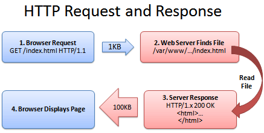
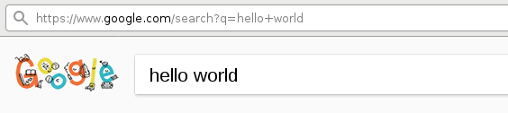
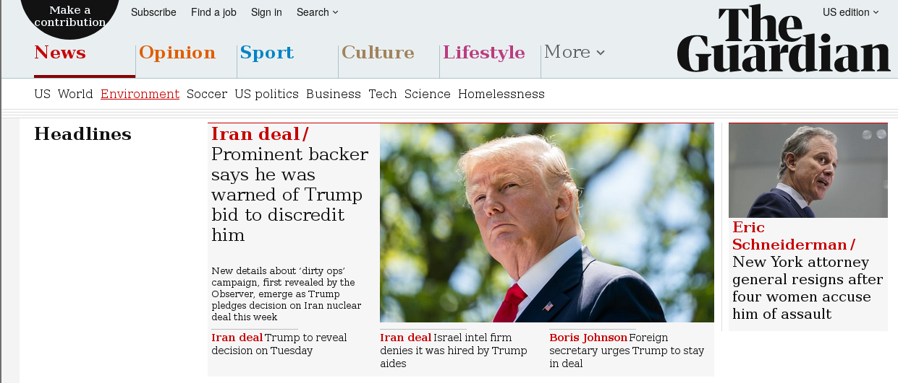

# The Internet

## The Internet and World Wide Web

* The **Internet** is a *physical network* of cables and routers, and a set of protocols for moving information across that network.

* The **World Wide Web** (WWW) is an *information space* on the Internet. It combines several concepts:

    * Uniform Resource Locator (url)
    * Hypertext Transfer Protocol (http)
    * Hypertext Markup Language (html)

## The Internet

* Started as a Defense Advanced Research Projects Agency (DARPA) ARPANET project to interconnect computers
* First transmission between nodes at UCLA in 1969; by 1970 reached across the US to Boston.
* Transmission Protocol/Internet Protocol (TCP/IP) developed during the 1970s
* ARPANET declared "operational" in 1975 and transferred to military
* Ethernet (transmission on wires) standard written 1981
* During 1980s, shift to National Science Foundation
    * NSFNET provided the backbone of Internet from 1985 to 1995
* Internet backbone privatized under Clinton in 1994

## 

TODO: image of early internet

## 

TODO: image of later internet

## Uniform Resource Locator

URLs are a system of globally unique identifiers for resources on the Web and elsewhere.

```
scheme://host[:port]/path[?query][#fragment]
```

* `scheme` is a protcol such as `http`, `https`, etc.
* `host` is something like `google.com` or `localhost`
* `:port` is optional, allows a single host to have separate websites
* `path` is the path to a particular resource like `index.html`
* More on queries later

# Hypertext Transfer Protocol (HTTP)

## HTTP Overview

* HTTP is the core communications protocol for retrieving data
* Consists of messages-- requests and responses-- sent between a client and a server



## HTTP Request

```html
GET /index.html HTTP/1.1
User-Agent: Mozilla/5.0
...
```

* First line contains:
    * HTTP method, here `GET`
    * Requested URL
    * HTTP version
* Rest of request may contain:
    * User-Agent: description of the client
        * Used e.g. to determine whether to serve mobile website version

## HTTP Methods
* `GET`
    * Most common method, used to get data
* `POST`
    * Used to send data to server, e.g. form entries, search queries

## HTTP Responses

```html
HTTP/1.1 200 OK
...
```

* First line contains:
    * HTTP version
    * HTTP response code
* Rest of response contains:
    * Additional headers: `Server`, `Content-Type`, etc.
    * Requested Content

## HTTP Response Codes

* 1xx: Informational
* 2xx: Success
    * 200: OK
* 3xx: Redirection
    * 301: Redirect
* 4xx: Errors
    * 404: File not found
    * 403: Forbidden

## HTTP GET Request Parameters

```
/index.php?name1=value1&name2=value2
```

* Query string with parameters sent in the URL of a GET request
* Parameter names and values are like a python dictionary
* Shouldn't use with sensitive data



# Hypertext Markup Language (HTML)

## Web browser 



## HTML sourcecode


## HTML overview

* Language that webpages are written in
* Consists of *tags*
* Most tags come in pairs (opening and closing):
    * `<html></html>`
    * `<head></head>`
    * `<body></body>`
    * `<a></a>`
* Some do not:
    * ``
    * `<br>`
* Whitespace doesn't matter (unlike Python)

## Basic HTML webpage

```html
<html>

<head>
    <title>My Title</title>
</head>

<body>
<h1>My Site</h1>
<p>
More information <a href="main.html">here</a>.
</p>

</body>
</html>
```

## Basic webpage

 

## More HTML tags

## HTML links

TODO

## HTML Tables

TODO: list tags

## Other web technologies

* Javascript
    * `.js` files sourced or code directly embedded in `<script>...</script>` tags
    * Used to make content dynamic
* CSS
    * `.css` files or code embedded in `<style></style>` tags
* Server-side languages
    * Ruby, PHP, Python (Django), Java, etc.

# Web Scraping

## Web scraping overview

TODO

## Ethical considerations

## When is scraping useful?

## `curl` revisited

## Scraping in python

* `urllib`: module for handling URLs
    * `urllib.request()` function for opening and reading data from URL
* `Beautiful Soup`: for structuring data from HTML files
