# Writing files

## Reading

Recall that we could read a file as follows:

```python
file = open('filename.txt')
contents = file.readlines()
```

## Writing
Similarly, we can write:

```python
file = open('filename.txt', 'w')
file.write('First line')
file.write('Second line')
file.write('Still second line\n')
file.close()
```

* Note the format argument `'w'`, indicating that we want to write to the specified file.
    * `'w'` will overwrite any existing file
    * To append, use `'a'`
* If you don't close the file when you're done, bad things can happen.

## `with` block

To avoid remembering to close the file, you can wrap your witing in a `with` block. Python will automatically close the file when the block is finished.

```python
with open('filename.txt', 'w') as file:
    file.write('First line')
    file.write('Second line')
    file.write('Still second line\n')
```

# Reshaping/Pivoting

## Hierarchical index

When we groupby with two keys the result has what's called a multiindex or a hierarchical index:

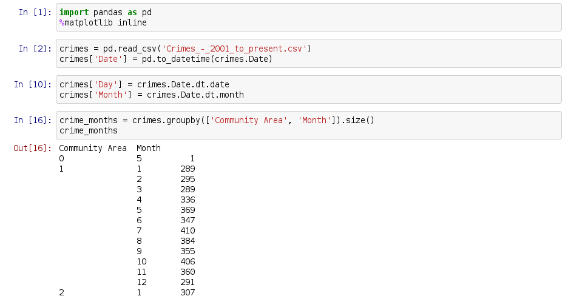

## Simpler example
```python
>>> df = pd.DataFrame([[0, 1, 2], [3, 4, 5]],
                      index=['Ohio', 'Colorado'],
                      columns=['one', 'two', 'three'])
>>> df
          one  two  three
Ohio        0    1      2
Colorado    3    4      5
```

To *reshape* into a hierarchical index use `stack()`:

```python
>>> s = df.stack()
>>> s
Ohio      one      0
          two      1
          three    2
Colorado  one      3
          two      4
          three    5
dtype: int64
```

Now the data is a series.

## `unstack()`

The inverse to this operation is `unstack()`:

```python
>>> s.unstack()
          one  two  three
Ohio        0    1      2
Colorado    3    4      5
```

## Unstack crimes

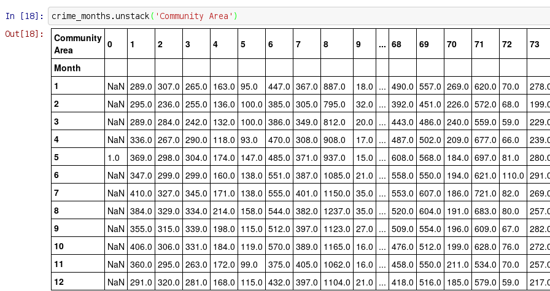

## Time series

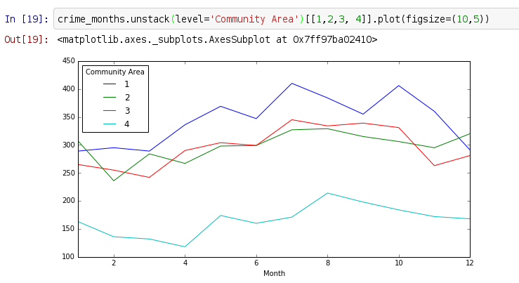

# Visualizations

## Matplotlib

* Matplotlib is the core of all plotting in python
* When you use pandas (or seaborn) to plot, it is using matplotlib.
* As a result, matplotlib settings will affect pandas plots

## Matplotlib rcParams

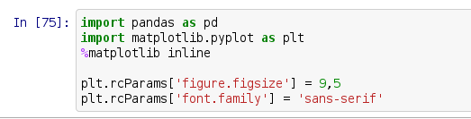

## Axes
Plot functions like `DataFrame.plot()` or `Series.hist()` return matplotlib `Axes` objects:

```python
>>> s = pd.Series([1,2,3,4])
>>> ax = s.plot()
>>> ax
<matplotlib.axes._subplots.AxesSubplot at 0x7fa917dac410>
```

You can use these Axes objects to customize the plot.

## Axes customization

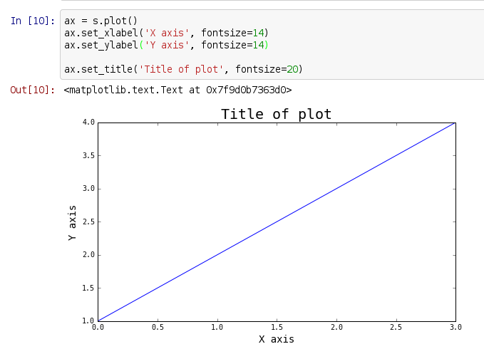

## Wages data

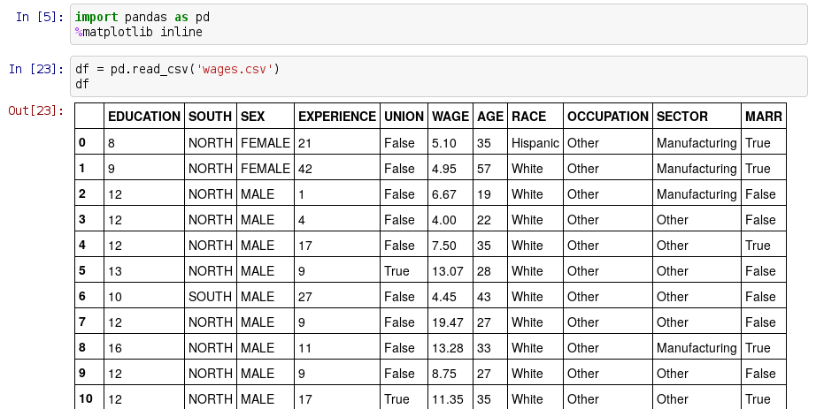

From [1985 CPS](http://lib.stat.cmu.edu/datasets/CPS_85_Wages), CSV [here](https://github.com/harris-ippp/lectures-s18/raw/master/08/wages.csv).

## Boxplot

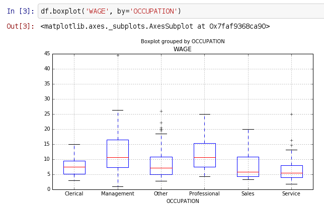

## Seaborn
* Seaborn is a visualization module that builds on matplotlib
    * So what we know about matplotlib Axes and rcParams still applies
* Provides a lot of very useful plots and options

## Seaborn boxplot

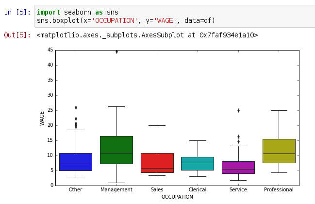

## Seaborn boxplot `hue`

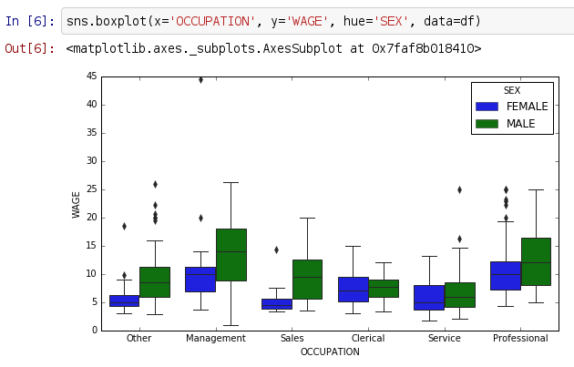

## [Seaborn aesthetics](https://seaborn.pydata.org/tutorial/aesthetics.html)

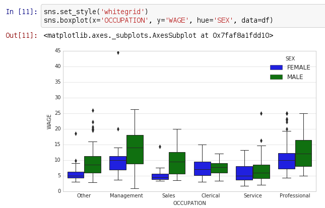

## Seaborn `pairplot()`

{ height=90% }

## Seaborn `regplot()`

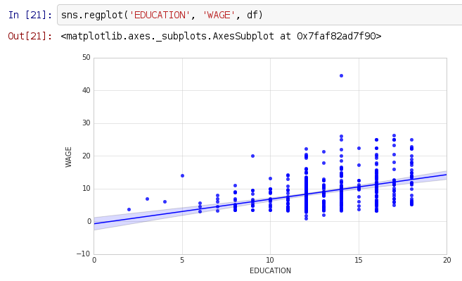

## Another `regplot()`

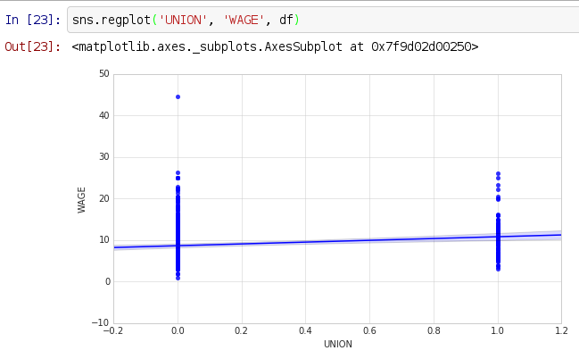

## Jittering

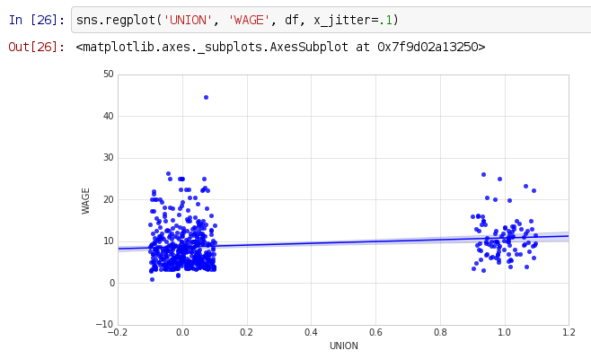

## `pairplot` `kind='reg'`

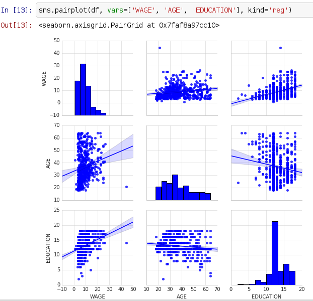{ height=90% }

## `pairplot` `hue`

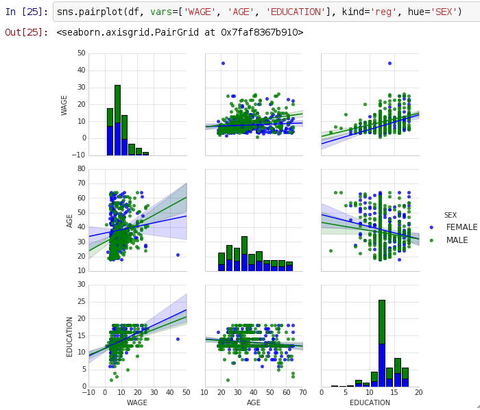{ height=90% }

# Regression in Python

## Statsmodels

* Statsmodels is an econometrics/statistics library for python.
* It provides OLS, logistic and other regression functions.
* There are other modules that can perform regression (e.g. `scipy` and `sklearn`)
    * But statsmodels has the best output

## X,y
One way to run a regression with statsmodels is to provide a exogenous design matrix and an endogenous outcome vector:

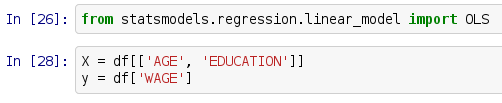

## statsmodels regression

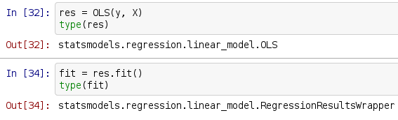

## Regression `summary()`

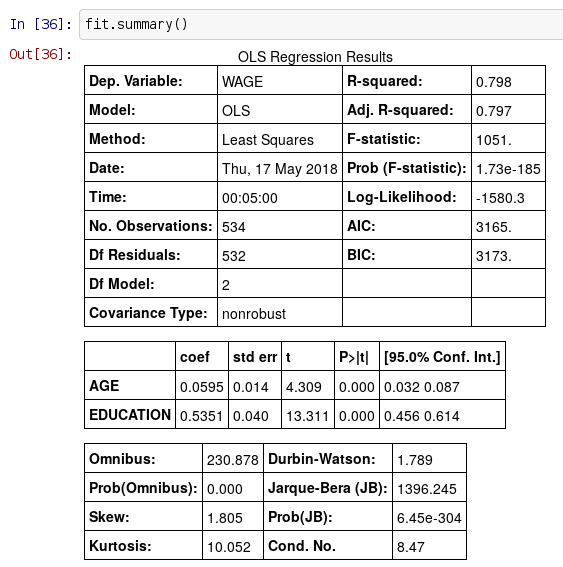{ height=90% }

## Add a constant

You could add a constant like this and then rerun the regression:

{ height=80% }

## Fitted values

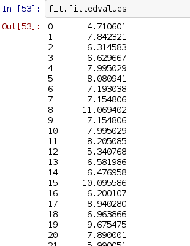

## Residuals

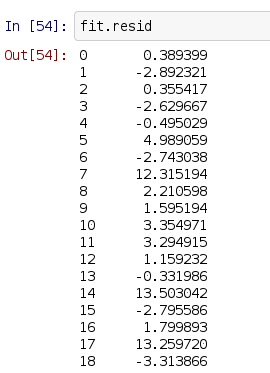

## Coefficients

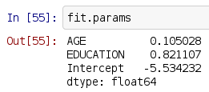

## Formulas
It's more convenient to run a regression using formulas:

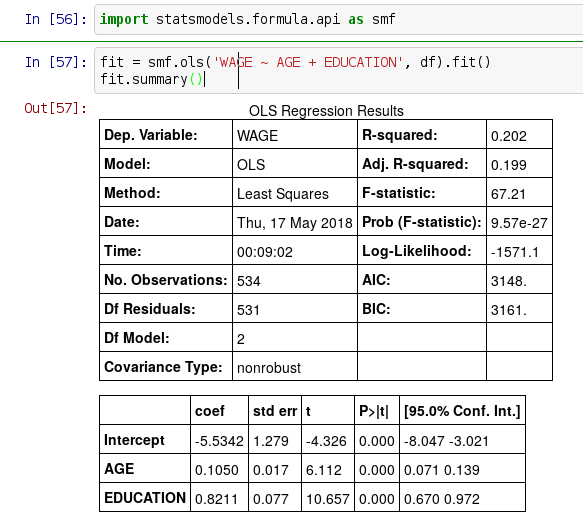

## Formula anatomy

```python
WAGE ~ AGE + EDUCATION
```

* The variable on the left of the `~` is the outcome
* The variables on the right are separated by plus signs

## Formula intercepts
* Formulas include an intercept term on the right-hand side by default. To remove it use

    ```python
    WAGE ~ EDUCATION + AGE - 1
    ```

* You can also specify the intercept explicitly (same as not specifying it):

    ```python
    WAGE ~ EDUCATION + AGE + 1
    ```

## Formulas with `numpy` functions
With formulas you can apply functions to the covariates or dependent variable:

```python
np.log(WAGE) ~ EDUCATION + AGE + 1
```

## Formula interactions

Formulas allow you to play around with different specifications easily.

* To add the interaction of two variables use `a:b`
* To add the variables and their interaction use `a*b`
    * So `a*b` is equivalent to `a + b + a*b`

## Formulas with categorical variables
By default, variables with string values become dummy variables (fixed effects) in the regression:

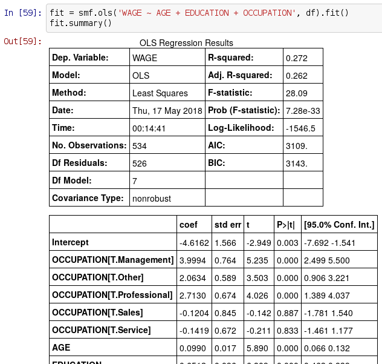

## Formula `C()`
For numeric columns to be interpreted as categories use `C()`:

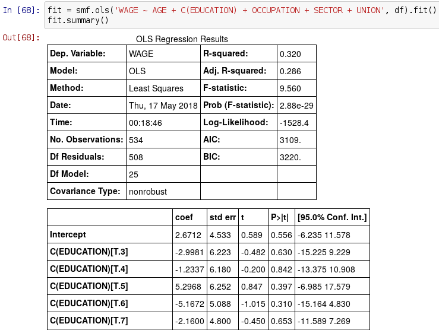

## Other models

* [Logit](http://www.statsmodels.org/stable/generated/statsmodels.discrete.discrete_model.Logit.html)
* [Weighted least squares](http://www.statsmodels.org/0.6.1/examples/notebooks/generated/wls.html)

# Statistical testing

## SciPy

`SciPy` (Scientific Python) is a library of scientific tools for python. It includes, among many other things, a submodule `scipy.stats` with a many statistical test functions.


## Log wages by sex

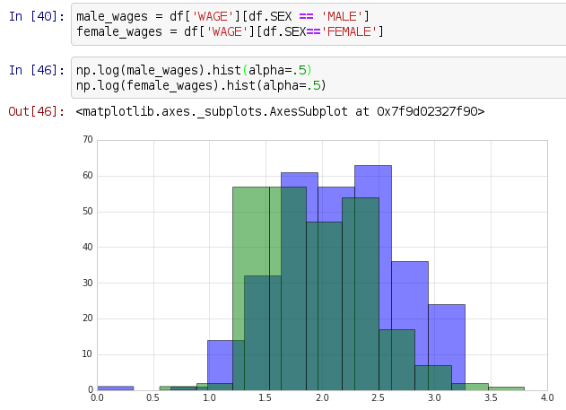

## t-test

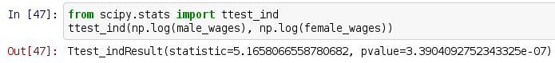

## Other stats

* [1 sample t-test](https://docs.scipy.org/doc/scipy/reference/generated/scipy.stats.ttest_1samp.html)
* [1- and 2-sample z-test](http://www.statsmodels.org/dev/generated/statsmodels.stats.proportion.proportions_ztest.html)
* [Spearman's rank correlation](https://docs.scipy.org/doc/scipy-0.14.0/reference/generated/scipy.stats.spearmanr.html)


