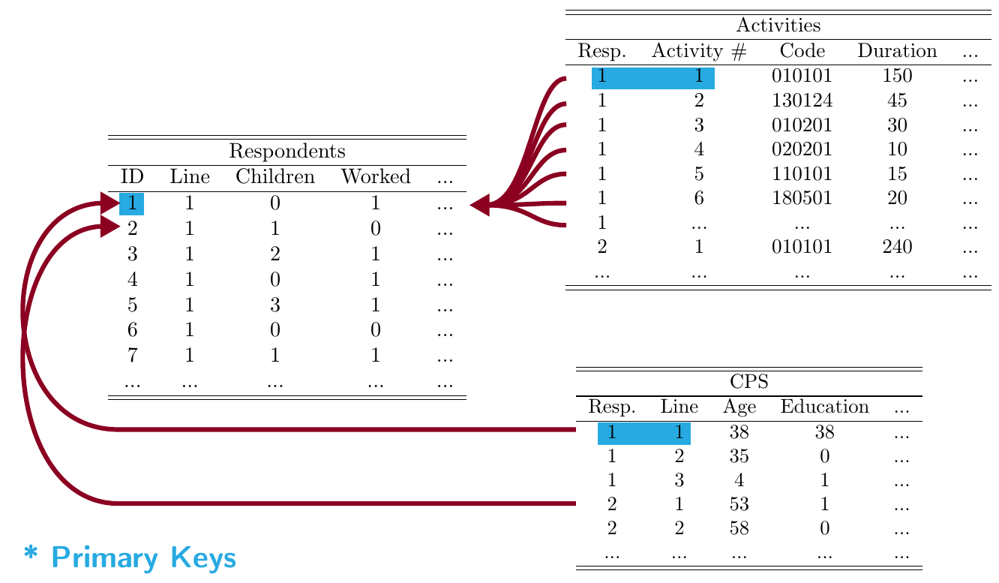

# Databases

## Databases as Infrastructure

* Since they are not consumer-facing, the importance of databases as a technological infrastructure is not widely appreciated.

* They are a key component in most applications including websites, health records, supply chains, etc.

## Why databases?

* Databases efficiently store and retrieve data.
    * Typical computers have about 8GB memory, a hard limit on what you can simultaneously load.
    * Databases allow efficient row-wise operations
    * Efficiently search hundreds of GB of data
    * Maintain one copy of the data and allow many people to access it (database server)

## Example: American Time Use Survey (ATUS)




## Relational databases
Most databases use a *relational* model:

* Data are stored in *tables*
* Tables are linked using *keys*
* Interact with database using Structured Query Language (SQL)

## Why *not* relational databases?

* Extremely large datasets (thousands of gigabytes)
* Not all data is relational (there are databases for that, too!)
* Not all tasks are database tasks (e.g. file manipulation, networking, image processing)

## Normal Forms (E.F. Codd 1971)

:::incremental
1. Each record (row) should be 'atomic', i.e. non-divisible. A single record should not contain multiple divisible pieces.
    * e.g. `respondents` table should not have a cell with the ages of all household members (instead there is a `roster` table)

2. No non-prime attribute of the table may be dependent on a proper subset of any candidate key.
    * e.g. the activity table, identified by the respondent and activity number, should not contain general information on the respondent.

3. The values in a row should refer uniquely to the key, not to a non-key attribute.
    * e.g. the `activities` table should not include both the activity code and its definition.
:::

## Good practice

* Each table should contain a single logical element, without repetition.

* Meaningful and carefully selected *primary key*.

* Appropriate primary keys are what allow databases to work efficiently.

## Database concepts

* Tables
* Variables
    * Types
* Constraints
    * Unique
    * Non-null
    * Primary key
    * Foreign key

The collection of tables, variables and constraints together define a database *schema*.

# Structured Query Language (SQL)

## SQL Overview

* The most popular model among databases is relational. These systems are called *RDBMS*s.
* SQL is the standardized language for working with an RDBMS.
* Originally intended to be user-facing and fairly "intuitive".
* Despite standardization, the implementations (e.g. Oracle, PostgreSQL, SQLite) all have some differences.

## Running SQLite

Download the [`atus.sqlite`](https://github.com/harris-ippp/lectures-s18/raw/master/09/atus.sqlite) file then run this at the command line (in the same directory as the downloaded file):

```bash
$ sqlite3 atus.sqlite
SQLite version 3.13.0 2016-05-18 10:57:30
Enter ".help" for usage hints.
sqlite>
```

## Navigating SQLite

The biggest differences between RDBMSs are accessing the metadata. To show tables in the database:

```bash
sqlite> .tables
activities   cps          respondents  roster
```

## Table schema
To show the schema of a table (its columns and types):

```sql
sqlite> .schema --indent cps
CREATE TABLE cps(
  case_id INTEGER,
  line_no INTEGER,
  family_income INTEGER,
  educational_attainment INTEGER,
  duration_of_masters INTEGER,
  years_in_college INTEGER,
  marital_status INTEGER,
  state_code INTEGER,
  age INTEGER,
  years_education INTEGER,
  PRIMARY KEY(case_id, line_no)
);
```

Possible types: integer, real (float), text (string)

## [Full schema](https://github.com/harris-ippp/lectures-s18/raw/master/09/schema.txt)

```sql
sqlite> .fullschema --indent
CREATE TABLE roster(
  case_id INTEGER,
  line_no INTEGER,
  how_related INTEGER,
  edited_age INTEGER,
  edited_sex INTEGER,
  PRIMARY KEY(case_id, line_no)
);
CREATE TABLE respondents(
  case_id INTEGER,
  line_no INTEGER,
  daily_time_alone INTEGER,
  daily_time_secondary_childcare_hh_or_own_children INTEGER,
  worked_last_week INTEGER,
  daily_time_with_family INTEGER,
  daily_time_with_friends INTEGER,
  daily_time_secondary_childcare_hh_children INTEGER,
  retired INTEGER,
  number_of_hh_children INTEGER,
  dow_of_diary_day INTEGER,
  spouse_or_partner_present INTEGER,
  edited_labor_force_status INTEGER,
  total_usual_hours_worked INTEGER,
  age_of_youngest_hh_child INTEGER,
  PRIMARY KEY(case_id, line_no)
);
CREATE TABLE activities(
  case_id INTEGER,
  activity_n INTEGER,
  activity_code INTEGER,
  duration INTEGER,
  PRIMARY KEY(case_id, activity_n)
);
CREATE TABLE cps(
  case_id INTEGER,
  line_no INTEGER,
  family_income INTEGER,
  educational_attainment INTEGER,
  duration_of_masters INTEGER,
  years_in_college INTEGER,
  marital_status INTEGER,
  state_code INTEGER,
  age INTEGER,
  years_education INTEGER,
  PRIMARY KEY(case_id, line_no)
);
/* No STAT tables available */
```

## Data dictionaries

* [ATUS Data Dictionary](https://www.bls.gov/tus/atuscpscodebk16.pdf):
    * `family_income`: p. 14
    * `educational_attainment`: p. 28
    * `marital_status`: p. 59
* [ATUS Lexicon](https://www.bls.gov/tus/lexiconwex2016.pdf)

## Selecting columns

To see all of the data in the `cps` table:

```sql
SELECT * FROM cps;
```

To see just two of the columns:

```sql
SELECT marital_status, years_education FROM cps;
```

Notes:

* Queries end with a semi-colon
* Upper case keywords (`SELECT`, `FROM`, etc.) are a convention but not necessary.
* No whitespace requirements.

## Query output

```sql
sqlite> SELECT * from cps;
...
20151212152498|1|11|43|-1|-1|1|39|37|17
20151212152498|2|11|43|-1|-1|1|39|34|17
20151212152498|3|11|-1|-1|-1|-1|39|8|-1
20151212152498|4|11|-1|-1|-1|-1|39|5|-1
```

You may prefer the output after changing these settings:
```sql
sqlite> .mode columns
sqlite> .headers on
```

## `LIMIT`

Akin to `head` in the command line and pandas, use the SQL keyword `LIMIT` to restrict output:

```SQL
SELECT * FROM cps LIMIT 10;
```

## `WHERE`

To restrict to rows satisfying a certain condition use a `WHERE` clause.

* when `years_education = -1` the education variable is missing:

```sql
SELECT years_education
FROM cps
WHERE years_education > -1;
```

* Use `AND`, `OR`, `NOT` to perform boolean logic, as in python:

```sql
SELECT years_education, state_code
FROM cps
WHERE years_education > -1 AND
      state_code = 17;          -- 17 is Illinois
```

* Comment to end of line using `--` (akin to `#` in python)

## `ORDER BY`

:::incremental
* Can sort results by a column (defaults to ascending):

    ```sql
    SELECT * FROM cps
    ORDER BY family_income;
    ```

* To make it descending:

    ```sql
    SELECT * FROM cps
    ORDER BY family_income DESC;
    ```

* Combine with `LIMIT` as to find top or bottom:

    ```sql
    SELECT * FROM cps
    ORDER BY family_income DESC
    LIMIT 10;
    ```
:::

## `COUNT`

Very useful *aggregate* function is `COUNT`:

```sql
SELECT COUNT(*) FROM cps 
WHERE educational_attainment > -1;
```

An aggregate function is one that returns a single row for the table.

## `COUNT` details

* Could do `COUNT(family_income)` or `COUNT(age)` to count the number of non-null values in the given column.
* In this data nothing is null, missingness is represented by -1.
* `COUNT(*)` counts all rows.

## More aggregates

* To calculate the average value of a column:

    ```sql
    SELECT AVG(age) FROM cps;
    ```

* To get the maximum:

    ```sql
    SELECT MAX(age) FROM cps;
    ```

* And minimum:

    ```sql
    SELECT MIN(age) FROM cps;
    ```

* Combine them:
    
    ```sql
    SELECT MIN(age), AVG(age), MAX(age)
    FROM cps;
    ```

## Booleans and aggregation

To find the proportion of respondents whose educational attainment is available that have a bachelors degree:

```sql
SELECT AVG(educational_attainment > 42)
FROM cps
WHERE educational_attainment > 0;
```
