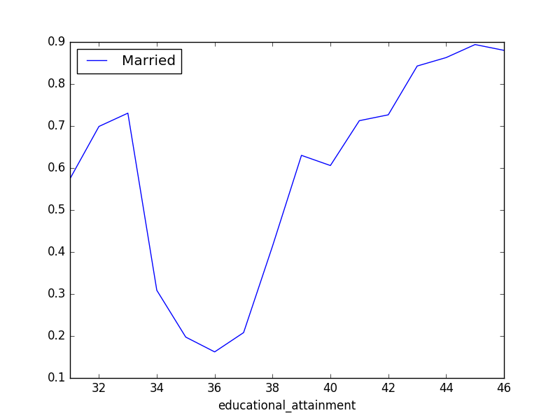
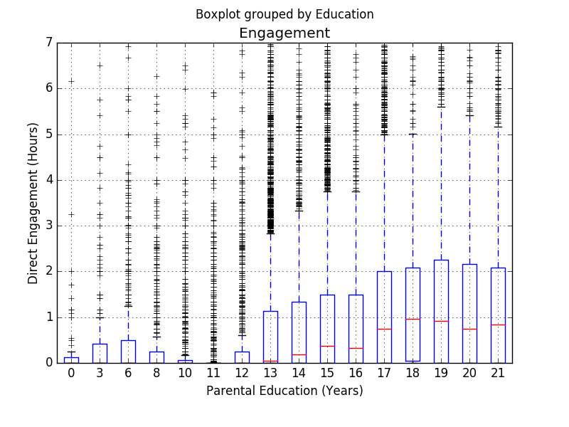

# More SQL

## Saved scripts

Save a query to a file, e.g. `p_bachelors.sql`:

```sql
SELECT AVG(educational_attainment > 42)
FROM cps
WHERE educational_attainment > 0;
```

Then execute it from the command line like so:

```bash
$ sqlite3 atus.sqlite < p_bachelors.sql 
0.242895945308274
```

## `GROUP BY`

```sql
SELECT number_of_hh_children,
       count(*),
       AVG(daily_time_alone/60)
FROM respondents
GROUP BY number_of_hh_children;
```

```sql
number_of_hh_children  count(*)  AVG(daily_time_alone/60)
---------------------  --------  ------------------------
0                      6360      7.10943396226415          
1                      1944      3.92181069958848          
2                      1734      3.42214532871972          
3                      599       2.779632721202            
4                      190       3.07368421052632          
5                      49        3.26530612244898          
6                      23        3.30434782608696          
7                      3         2.33333333333333          
8                      2         0.5                       
9                      1         0.0                       
```

## `GROUP BY` with `ORDER BY`
```sql
SELECT state_code,
       COUNT(*) as Count,
       AVG(educational_attainment > 42) AS Bachelors
FROM cps
WHERE educational_attainment > 0 -- i.e. defined
GROUP BY state_code
ORDER BY Bachelors DESC
LIMIT 10;
```

Notes:

* In a `GROUP BY`, the `WHERE` clause filters the rows going in to the aggregation
* `ORDER BY` orders the resulting groups, not the rows in the source table (cps).
* `AS` gives the column an alias

## `HAVING`
* In a `GROUP BY`, the `WHERE` clause filters the rows going in to the aggregation.

* To filter the resulting groups use `HAVING`:

    ```sql
    SELECT state_code,
           COUNT(*) as Count,
           AVG(educational_attainment > 42) AS Bachelors
    FROM cps
    WHERE educational_attainment > 0 -- i.e. defined
    GROUP BY state_code
    HAVING Count > 100
    ORDER BY Bachelors DESC
    LIMIT 10;
    ```

## `JOIN`

Relational databases are all about relationships! We can harness the relationships in the data with a `JOIN` query:

```sql
SELECT cps.case_id, 
       educational_attainment,
       spouse_or_partner_present
FROM respondents
JOIN cps
ON respondents.case_id = cps.case_id AND
   cps.line_no = 1;
```

Use `LEFT JOIN`, `RIGHT JOIN`, `FULL OUTER JOIN` as needed.

The result of this query has a row for each respondent (all respondents are in the CPS table).

## `JOIN` with `GROUP BY`

The combination of `JOIN` and `GROUP BY` is very powerful:

```sql
SELECT
  educational_attainment,
  AVG(spouse_or_partner_present = 1) Married
FROM cps JOIN respondents
ON cps.case_id = respondents.case_id AND
   cps.line_no = 1
WHERE number_of_hh_children > 0
GROUP BY educational_attainment;
```

## Hours of sleep

```sql
SELECT case_id,
       SUM( (activity_code = 010101) * duration) / 60
           AS sleep
FROM activities
GROUP BY case_id
```

## Subqueries

We can treat the result of one query as a temporary table in a new query:

```sql
SELECT case_id, edited_labor_force_status, sleep
FROM respondents JOIN
(SELECT case_id,
        SUM( (activity_code = 010101) * duration) / 60
            AS sleep
    FROM activities
    GROUP BY case_id
)
USING (case_id);
```

## Adding a `GROUP BY`
```sql
SELECT edited_labor_force_status, AVG(sleep)
FROM respondents JOIN
(SELECT case_id,
        SUM( (activity_code = 010101) * duration) / 60
           AS sleep
    FROM activities
    GROUP BY case_id
)
USING (case_id)
GROUP BY 1; 
```

```bash
edited_labor_force_status  AVG(sleep)      
-------------------------  ----------------
1                          8.10439043512348
2                          8.67241379310345
3                          8.86080178173719
4                          8.93861174267754
5                          8.79434148088459
```

## `CREATE TABLE AS`

```sql
CREATE TABLE sleep AS
    SELECT case_id,
           SUM( (activity_code = 010101) * duration) / 60
           AS sleep
    FROM activities
    GROUP BY case_id
;
```

```sql
SELECT edited_labor_force_status, AVG(sleep)
FROM sleep JOIN respondents
USING (case_id)
GROUP BY 1; 
```

## `DROP TABLE`

We can drop the `sleep` table:

```sql
DROP TABLE sleep;
```

Alternatively, you might find it useful to make the table temporary, so that it is not saved in the `atus.sqlite` database file:

```sql
CREATE TEMP TABLE sleep AS
    ...
;
```

## `CREATE TABLE`
We can create a new database by passing a non-existent file to `sqlite3`:

```bash
$ sqlite3 new_db.sqlite
```

Now we can create a new table with the following SQL:

```sql
CREATE TABLE test (
    id INTEGER PRIMARY KEY,
    Name TEXT,
    Birthday TEXT
);
```

## `INSERT`
We can insert a record into the table using an `INSERT` statement:

```sql
INSERT INTO test (Name, Birthday)
VALUES ('Eric', '1987-09-23');
```

We can check that it worked:

```sql
sqlite> SELECT * FROM test;
id          Name        Birthday  
----------  ----------  ----------
1           Eric        1987-09-23
```

Because the `id` column is an `INTEGER PRIMARY KEY`, sqlite automatically populates it with an integer that it automatically increments.

## `INSERT` multiple records
```sql
INSERT INTO test (Name, Birthday)
VALUES ('Washington', '1732-02-22'),
       ('Adams', '1735-10-30');
```

```sql
sqlite> SELECT * FROM test;
id          Name        Birthday  
----------  ----------  ----------
1           Eric        1987-09-23
2           Washington  1732-02-22
3           Adams       1735-10-30
```

## `DELETE`

To delete all records simply use:

```sql
DELETE FROM test;
```

You can delete records matching a boolean condition from a table like so:

```sql
DELETE FROM test
WHERE Name = 'Eric';
```

## `UPDATE`

To update a column in a table use `UPDATE`:

```sql
UPDATE test
SET Birthday = '2000-01-01';
```

To update only those rows matching a boolean condition:

```sql
UPDATE test
SET Birthday = '2000-01-01'
WHERE Name = 'Eric';
```

To set new values using old values:

```sql
UPDATE test
SET Name = Name || ' 123';
```

Here `||` is the concatenation operator for strings, like `+` in python.

## Import a CSV

```sql
CREATE TABLE chicago (
    Last TEXT, First TEXT,
    Position TEXT, Department TEXT, FP TEXT, SH TEXT,
    Hours INTEGER, Salary REAL, Wage REAL
);
```

Databases have special functions for loading data from various file formats:

```sql
.import salaries.csv chicago
```

# Python Integration

## `sqlite3` module

`sqlite3` module allows python to connect to sqlite and execute queries:

```python
import sqlite3

con = sqlite3.connect('atus.sqlite')
result = con.execute("SELECT * FROM cps")
for row in result:
    print(row)
```

## `pandas` and `sqlite3`

```python
import sqlite3
import pandas as pd

con = sqlite3.connect('atus.sqlite')
cps = pd.read_sql('SELECT * FROM CPS',
                  con,
                  index_col='case_id')
```


## Read query from file

Save `marriage_by_education.sql`:
```sql
SELECT
  educational_attainment,
  AVG(spouse_or_partner_present = 1) Married
FROM cps JOIN respondents
ON cps.case_id = respondents.case_id AND
   cps.line_no = 1
WHERE number_of_hh_children > 0
GROUP BY educational_attainment;
```

## Plot query results

```python
with open('marriage_by_education.sql') as f:
    sql = f.read()
m = pd.read_sql(sql, con, 
                index_col='educational_attainment')
m.plot()
```

{ height=50% }


## Child engagement example

* Want to explore the relationship between years of education and time spent with children.
    * Years education is in the `cps` table
    * Time spent with children is codes 301XX, 302XX, and 303XX.

* Also want to restrict to:
    * respondents with at least one child (`number_of_hh_children > 0`)
    * employed (`edited_labor_force_status < 3`)
    * These columns are in the`respondents` table.
* So we need to `JOIN` three tables: `respondents`, `cps`, and `activities`

## Child engagement SQL

```sql
SELECT
  respondents.case_id,
  cps.years_education AS Education,
  SUM (( activity_code/100 IN (301, 302, 303))
          * duration /60.0) AS Engagement
FROM respondents
JOIN cps ON
  respondents.case_id = cps.case_id AND
  respondents.line_no = cps.line_no
JOIN activities ON
  respondents.case_id = activities.case_id
WHERE
  number_of_hh_children > 0 AND
  edited_labor_force_status < 3
GROUP BY respondents.case_id;
```

## Child engagement Python

```python
import sqlite3
import pandas as pd
from matplotlib import pyplot as plt

con = sqlite3.connect('atus.sqlite')
with open('child_engagement.sql') as f:
   sql = f.read()

df = pd.read_sql(sql , con)
ax = df.boxplot('Engagement', 'Education')
ax.set(ylim = (0, 7),
       xlabel="Parental Education (Years)",
       ylabel="Direct Engagement (Hours)")
```

## Child engagement plot


