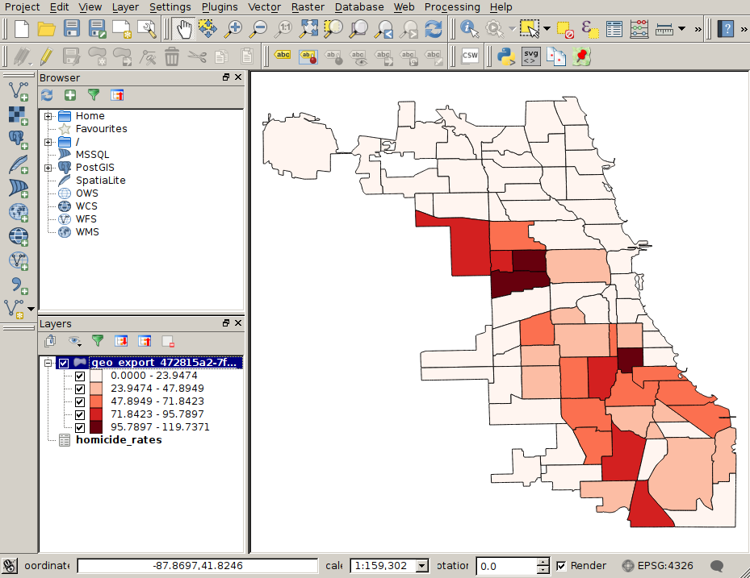
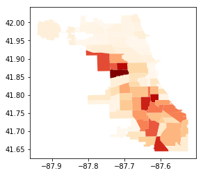

# Introduction to GIS

## What is GIS?

Software for working with geographic data including creation, analysis, and visualization.

## GIS Data

* There are two basic types of GIS data:
    * Vector, stored in Geodatabase, Shapefile, KML, etc.
    * Raster stored in GeoTIFF files, etc.

## Vector data

Vector data are shapes:

* Points (e.g. [crime locations](https://data.cityofchicago.org/Public-Safety/Crimes-2017/d62x-nvdr))
* Lines (e.g. [streets](https://data.cityofchicago.org/Transportation/Street-Center-Lines/6imu-meau))
* Polygons (e.g. [community areas](https://data.cityofchicago.org/Facilities-Geographic-Boundaries/Boundaries-Community-Areas-current-/cauq-8yn6/data))

## Vector attributes

In addition to storing the shapes (e.g. community areas) themselves, *shapefiles* commonly also have tabular data for each shape. 


## Raster data

Raster data store a value for each cell in a geographic grid. The value could represent color, elevation, land use, etc.


## Layers

A typical GIS problem may involve many kinds of GIS data that are stacked on top of each other.

{ height=70% }

## Latitude-longitude

Chicago center has latitude 41.8781° N and longitude 87.6298° W. What does that mean?

{ height=60% }

## WGS84

The above coordinates for Chicago use a *datum* called WGS84 that was developed by the U.S. Department of Defense and used in its Global Positioning Satellites (GPS).

## Projections

Latitude/longitude are not a consistent measure, e.g. one degree of latitude is 68.7 miles long at the equator but 69.4 miles at the poles.

Latitude-longitude is a good system for storing data but less good for analyzing and visualizing it. So we use *projections*.

## Projection trade-offs

Every projection distorts at least one of the following:

* Area
* Direction
* Shape
* Distance

## Projection types


## Local projections

The *State Plane Coordinate System* is a collection of 124 coordinate systems that cover the U.S.

E.g. Illinois State Plane East, this is the coordinates that the Chicago crime data were in.


## Operations

The most common GIS operations are:

* Distance: the distance between points
* Length: the length of a line segment (or sequence of lines)
* Area: the area of a polygon
* Intersection: the intersection of multiple polygons

## Spatial Join

Just like with non-spatial data, it can be useful to join spatial data. Examples of join conditions include:

* Containment: find the community area containing each crime
* Distance: find the hospital closest to each accident
* etc.

# GIS Software

## Standalone software

* Desktop
    * QGIS
    * ESRI ArcGIS

* Web
    * Carto
    * Mapbox

## Homicide rate map

In the next few slides we will use QGIS to make a map of Chicago where the community areas are color-coded by homicide rate.

## Homicide rate map: export CSV

First, export homicide rates to csv from python:

```bash
$ head homicide_rates.csv
Community Area Number,Homicide Rate
1,7.27391755014
2,2.78001723611
3,8.87122529364
4,2.53209429519
5,0.0
6,0.0
7,1.55967309252
8,6.21241488992
9,0.0
```

## Homicide rate map: import CSV

* Select `Layer > Add Layer > Add Delimited Text Layer` from the QGIS menu.
* Then select the `homicide_rates.csv` file
* Select `No geometry (attribute only table)`

{ height=60% }

## Homicide rate map: import shapefile

* Select `Layer > Add Layer > Add Vector Layer`
* Then select the community areas shapefile (`geo_export_472815a2-7f5d-40c8-be47-2f8ab88a4466.shp`)
* After importing, right click the shapefile layer and click `Zoom to layer`


## Homicide rate map: attribute table

Right click the shapefile layer and click `Attribute Open Attribute Table` to see the community area attributes.


## Homicide rate map: join
* Right click the shapefile layer and click `Properties`
* Click on the `Joins` panel and click the green `+` 
* Select `homicide_rates` as the Join layer, `Community Area Number` as the Join field, and `area_numbe` as the Target field.


## Homicide rate map: style
* If you re-open the attribute table, you'll see a new field from the join: `homicide_rates_Homicide Rate`
* You can make the style of the map a function of this field in the `Properties > Style` panel.


## Homicide rate map


## Homicide rate map: street layer
It can be useful to add a layer of streets and place names to a map.

* Install the `OpenLayers Plugin` from `Plugins > Manage and Install Plugins`
* Select `Web > OpenLayers plugin` and one of the maps (e.g. OpenStreetMap).


## Geopandas

Geopandas is a python module that extends pandas to support geographic data. Geopandas provides two main objects:

* `GeoSeries` is a series of geographic data (e.g. points, lines, or shapes)
* `GeoDataFrame` is a DataFrame that contains a `GeoSeries`

## `read_file`

We can load a shapefile, e.g. the community areas files, using `read_file`:

```python
import geopandas as gpd

gdf = gpd.read_file('geo_export_8356b3a3-2430-4e8b-acf0-38ef6fbbf97f.shp')
```


## `plot()`

```python
gdf.plot()
```

{ height=50% }

## `dtypes`
```python
>>> gdf.dtypes
perimeter     float64
community      object
shape_len     float64
shape_area    float64
area          float64
comarea       float64
area_numbe     object
area_num_1     object
comarea_id    float64
geometry       object
dtype:object
```

The community area number columns are text here but numbers in the homicide rate data, so we'll need to convert one to the other before merging.

## `merge`

```python
gdf['area_num_1'] = gdf['area_num_1'].astype(int)
gdf_merged = gdf.merge(df, left_on='area_num_1', right_on='Community Area Number')
gdf_merged.plot(column='Homicide Rate', cmap='OrRd');
```

{ height=50% }
